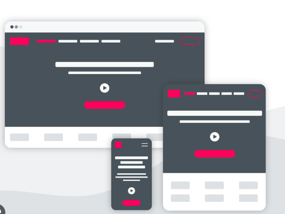

# Teorihandboken - HTML & CSS (HC)
Inlämningsdatum: 20231119   (Komplettering)

Studerande: 

### William Berhane 

### FWD-23 - Chas Academy

 

## Begrepp ord:

### CSS(stilmall) 
står för ***Cascading Style Sheet*** och ett programmering språk som stylar hur en hemsida ska se ut.

### Design
är ett metod där man i detalj fastställer hur ett system ska se ut innan man börjar realisera det.

### HTML
står för ***Hypertext Markup Language*** och ett språk man använder för att skriva och strukturera text, bilder och länkar på en hemsida. 

### Optimering 
är fastställande av det värde som ger det bästa utfallet för ett visst ändamål, till skillnad från det högsta värdet(maximering) eller det lägsta värdet (minimering).

### Responsiv
betyder att den anpassar sig med olika skärmstorlekar med hjälp av en flytande layout. 

### Tillgänglighet 
är det att en resurs i ett IT-system är möjligt att nå och att kommunicera med.

### Validering
kontroll av att något verkligenhar de egenskaper som det uppges eller förväntas ha. 

### Webb 
är där innehållet på hemsidorna till stor del skapas av användarna och är tillgängligt för alla.

>## HC 1.1 HTML <svg xmlns="http://www.w3.org/2000/svg" height="25" width="25" background-color="white" viewBox="0 0 384 512"><!--!Font Awesome Free 6.5.1 by @fontawesome - https://fontawesome.com License - https://fontawesome.com/license/free Copyright 2023 Fonticons, Inc.--><path d="M0 32l34.9 395.8L191.5 480l157.6-52.2L384 32H0zm308.2 127.9H124.4l4.1 49.4h175.6l-13.6 148.4-97.9 27v.3h-1.1l-98.7-27.3-6-75.8h47.7L138 320l53.5 14.5 53.7-14.5 6-62.2H84.3L71.5 112.2h241.1l-4.4 47.7z"/></svg>   & CSS    <svg xmlns="http://www.w3.org/2000/svg" height="25" width="25" viewBox="0 0 384 512"><!--!Font Awesome Free 6.5.1 by @fontawesome - https://fontawesome.com License - https://fontawesome.com/license/free Copyright 2023 Fonticons, Inc.--><path d="M0 32l34.9 395.8L192 480l157.1-52.2L384 32H0zm313.1 80l-4.8 47.3L193 208.6l-.3 .1h111.5l-12.8 146.6-98.2 28.7-98.8-29.2-6.4-73.9h48.9l3.2 38.3 52.6 13.3 54.7-15.4 3.7-61.6-166.3-.5v-.1l-.2 .1-3.6-46.3L193.1 162l6.5-2.7H76.7L70.9 112h242.2z"/></svg>

**HTML** står för "Hyper Text Markup Language" eller (extern stilmallar lagras i (.html)) och är det språk som alla webbsidor är byggda av. Det berättar hur en hemsida ska se ut och är alltså ett så kallat sidbeskrivningsspråk. Med hjälp av så kallade HTML-taggar kan du till exempel placera in bilder eller tabeller.

HTML5 är den senaste specifikationen för HTML-språket och representerade ett stort brott med tidigare uppmärkningsmetoder. Syftet med de djupgående förändringarna av språket var att standardisera de många nya sätt som utvecklare använde det på, samt att uppmuntra en enda uppsättning bästa praxis när det gäller webbutveckling.

De flesta av de individuella förändringarna är ett resultat av större mål i utformningen av språket. Dessa mål inkluderar främst:

- Uppmuntrande semantisk (meningsfull) uppmärkning
- Separera design från innehåll
- Främja tillgänglighet och designlyhördhet
- Minska överlappningen mellan HTML, CSS och JavaScript
- Stödja rika mediaupplevelser samtidigt som du eliminerar behovet av plugins som Flash eller Java
  
Att få grepp om HTML5 handlar inte bara om att lära sig vilka CSS-funktioner som ersätter gamla HTML-funktioner. Om du vill få en intuitiv känsla av HTML5 är det bäst att förstå hur dessa mål påverkade utvecklingen av språket.

#### Uppmuntrande semantisk uppmärkning (Encouraging Semantic Markup)

Semantisk markering betyder markering som har betydelse, snarare än markering som helt enkelt ser ut på ett visst sätt. Till exempel, `<h1>` - taggen antyder att innehållet i elementet är titeln eller rubriken för hela dokumentet. Den semantiska betydelsen skulle gå förlorad om vi bara gjorde texten fet och stor utan att använda lämplig tagg.

HTML har alltid haft lite semantisk markering tillgänglig för sig: `heading tags`, the `link rel attribute` och `document metadata`. Men det räckte inte.

I tidigare versioner av språket indikerades vanliga strukturella element som sidrubriker, navigeringsmenyer och huvudinnehållssektioner med samma HTML-element, taggen `
.` 
I HTML finns det en mängd nya semantiska element avsedda att indikera den grundläggande strukturen på en sida:

HTML  har taggar,elements, attributes och där kan man skapa hemsida och redigera hemsida via olika sorts av TextEditor, Notepad, Notepad++ och andra framwork appar på windows, Mac och Linux.

Ett vanligt structurade HTML hemsida ser ut som: 

Alla HTML- element har attribut:
   - href - attributet för `<a>` anger webbadressen till sidan som en länk går till. 
   - src - attributet för `` anger sökvägen till bilden som ska visas. 
   - Bredd - och höjdattributen för `` ger storleksinformation för bilder. 
   - Alt - attributet för `` tillhandahåller en alternativ text för en bild. 
   - Style - attributet används för att lägga till stilar till ett element, som färg, teckensnitt, storlek med mera.
   - Lang - attributet för `<html>` - taggen deklarerar webbsidans språk. 
   - title - attributet definierar lite extra information om ett element. 

Nya element på textnivå (inline) har också introducerats, såsom `<adress>` och `<tid>`. Dessa hjälper sökmotorer och andra tjänster att enkelt hitta information på en sida, för visning i andra sammanhang. Samtidigt har befintliga inline-element som ger olika effekter som fetstil, kursiv och understruken förfinats eller omdefinierats för att antyda specifik semantisk betydelse.

#### Separera design från innehåll
Tillsammans med starkt uppmuntrande semantisk (meningsfull) uppmärkning, avråder HTML5-specifikationen starkt icke-meningsfull uppmärkning – uppmärkning som endast är avsedd att tala om för webbläsaren hur man visar saker. Detta inkluderar saker som:

- deklarerar teckensnitt och textfärger
- ställa in textjustering eller justering
- placera bårder på bord
- definiera hur text lindas runt bilder

De flesta HTML-funktioner som möjliggjorde den här typen av saker har blivit helt utfasade. De få som fortfarande stöds officiellt kommer med varningar om att de vanligtvis inte rekommenderas.

Det finns främst två skäl att föredra denna separation:

- Det är lättare att underhålla och designa om en webbplats om stildeklarationerna är begränsade till CSS
- Användare ser webbinnehåll i många olika sammanhang – stationära datorer, bärbara datorer, surfplattor, mobiltelefoner, RSS-läsare och många andra. Stilar och designbeslut som är vettiga i en miljö är inte alltid vettiga i en annan. Så det är mycket bättre att ge semantisk information och låta innehållet anpassas till sammanhanget.
  
Denna sista punkt är nära knuten till...

#### Främja tillgänglighet och designlyhördhet (Promoting Accessibility and Design Responsiveness)

Alla interagerar inte med webben på samma sätt som du gör.

"Konventionella" enheter – stationära datorer, bärbara datorer, surfplattor och telefoner – presenterar ett brett utbud av skärmstorlekar, bildformat, bildskärmsupplösningar och användarupplevelser. Enbart denna variation borde vara tillräckligt för att uppmuntra semantiska och responsiva designpraxis. Men inte alla använder en "konventionell" webbläsare.

Blinda och synskadade surfar också på nätet och de använder en mängd olika hjälpmedel för att göra det. Skärmläsare som översätter en webbplatss innehåll till tal, specialiserade webbläsare som tar bort stil och presenterar mycket förstorad eller högkontrasttext, punkttolkare och tangentbordsbaserad navigering tillåter alla med icke-standardiserad syn att interagera med webbplatser.

Och alla dessa tekniker hindras av uppmärkning som försöker "hårdkoda" design och styling i innehållet på en sida.

#### Minska överlappningen mellan HTML, CSS och JavaScript (Reducing the Overlap Between HTML, CSS, and Javascript)

Tre språk definierar front-end webbutveckling - `HTML`, `CSS` och `JavaScript`.

Ingen satte sig i början av internet och kom på vilka typer av saker som hör till respektive språk. De utvecklades var och en parallellt med varandra, ofta överlappande i funktionalitet och omfattning.

Förutom de praktiska överväganden som räknats upp ovan har det också funnits ett fokus på att definiera karaktären och syftet med dessa språk, och begränsa dem (eller utöka dem) så att de gör vad som ligger i deras natur att göra:

- HTML — Innehåll
- CSS — Design
- JS — Interaktivitet

> ### CSS

**CSS** står för "Cascading Style Sheets" (eller extern stilmallar lagras i .css) och används att beskriva hur HTML-element ska visas på skärmen, paper eller i andra media. Det viktigaste fördelen av CSS är att det sparar mycket arbete att styra layouten på fler webbsidor och app:ar. 

### Hur CSS fungerar

När man skriver CSS är det många gånger som regler skrivs som står i konflikt med varandra. Till exempel, när du formaterar rubriker, kan alla följande regler gälla för ett `h1`-element.

- En regel på elementnivå som skapar konsekvent `h1`-rendering på alla sidor på webbplatsen.
- En regel på klassnivå som definierar renderingen av `h1`-element som förekommer på specifika platser – till exempel titlarna på blogginlägg.
- Ett element på id-nivå som definierar renderingen av ett `h1`-element som används på bara ett ställe på en eller flera webbsidor – till exempel webbplatsens namn.
  
Hur kan en utvecklare skriva regler som är tillräckligt generella för att täcka varje `h1` men ändå tillräckligt specifika för att definiera stilar som bara ska visas på specifika instanser av ett givet element?

CSS-stilar följer två regler som du måste förstå för att skriva effektiv CSS. 

De två reglerna som styr hur CSS beter sig är arv och specificitet.

#### Cascading Arv

Varför kallas CSS-stilar cascading? När flera regler skrivs som står i konflikt med varandra, kommer den sist skrivna regeln att implementeras.

[Arv av stilar/ Inheritance of styles](https://developer.mozilla.org/en-US/docs/Web/CSS/inheritance) är ett annat exempel på överlappande beteende hos CSS-stilar.

När du definierar en stil för ett överordnat element får de underordnade elementen samma stil. Till exempel, om vi tillämpar färgstil på en oordnad lista, kommer de underordnade listobjekten att visa samma stilar. 

[Inte varje egenskap överförs från en överordnad till dess underordnade element](https://developer.mozilla.org/en-US/docs/Learn/CSS/Building_blocks/Cascade_and_inheritance#inheritance). Webbläsare betraktar vissa egenskaper som icke-ärvda egenskaper. Marginaler är ett exempel på en egenskap som inte överförs från ett överordnat till ett underordnat element.

Ett vanligt css- strucuturad ser ut:

CSS har många Selectors och de mest grundläggande CSS-Selectors kan dela i fem kategorier:
   -  Simple selectors: (välj element baserat på `namn`, `id`, `klass`).
   -  Combinator selectors: (välj element baserat på ett specifikt förhållande mellan dem).
   - Pseudo-class selectors (välj element baserat på ett visst tillstånd).
   - Pseudo-elements selectors (välj och stil en del av ett element).
   - Attribute selectors (välj element baserat på ett attribut eller attributvärde).
  
En basic CSS-selectors exemplar:

### Specificitet

Den andra regeln som avgör vilka regler som tillämpas på varje HTML-element är [specificitetsregeln](https://developer.mozilla.org/en-US/docs/Web/CSS/Specificity).

CSS-regler med mer specifika väljare kommer att åsidosätta CSS-regler med mindre specifika väljare oavsett vad som inträffar först. Som vi diskuterade är de tre vanligaste väljarna elementtaggar, klasser och ID.

- Den minst specifika typen av väljare är elementnivåväljaren.
- När en klass används som väljare kommer den att åsidosätta CSS-regler skrivna med elementtaggen som väljare.
- När ett ID används som väljare kommer det att åsidosätta CSS-reglerna skrivna med element- eller klassväljare.
  
En annan faktor som påverkar specificiteten är platsen där CSS-stilarna skrivs. Stilar skrivna i linje med `Style` stilattributet åsidosätter stilar skrivna i en intern eller extern stilmall.

Ett annat sätt att öka specificiteten hos en väljare är att använda en serie element, klasser och ID:n för att lokalisera det element du vill adressera. Till exempel, om du vill peka ut oordnade listobjekt på en lista med klassen "exempel-lista" som innehåller en `div` med id:t "exempel-div" kan du använda följande väljare för att skapa en väljare med hög specificitet .
 
> div#example-div > ul.example-list > li {styles here}

Även om detta är ett sätt att skapa en mycket specifik väljare, rekommenderas det att begränsa användningen av dessa typer av väljare eftersom de tar längre tid att bearbeta än enklare väljare.

#### Vad kan CSS göra?
En bättre fråga kan vara: "Vad kan inte CSS göra?"

CSS kan användas för att förvandla ett HTML-dokument till en professionell, polerad design. Här är några av de saker du kan åstadkomma med CSS:

- Skapa ett flexibelt rutnät för att designa helt responsiva webbplatser som återges vackert på alla enheter.
- Style allt från typografi, till tabeller, till formulär och mer.
- Placera element på en webbsida i förhållande till varandra med hjälp av egenskaper som `float`, `position`, `overflow`, `flex` och `box-sizing`.
- Lägg till bakgrundsbilder till valfritt element.
- Skapa former, interaktioner och animationer.

Dessa koncept och tekniker går utöver den här inledande guiden, men följande resurser hjälper dig att ta itu med dessa mer avancerade ämnen.

#### Boxmodellen

Om du planerar att använda CSS för att bygga webbsideslayouter är ett av de första ämnena att bemästra boxmodellen. Boxmodellen är ett sätt att visualisera och förstå hur varje objekt på en webbsida är en kombination av innehåll, utfyllnad, kantlinje och marginal.

Att förstå hur dessa fyra delar passar ihop är ett grundläggande koncept som måste bemästras innan man går vidare till andra CSS-layoutämnen.

Två bra ställen att lära sig om boxmodellen inkluderar:

- En [förklaring av boxmodellen/explanation of the box model](https://www.w3.org/TR/CSS21/box.html) från World Wide Web Consortium.
- En [introduktion till CSS-boxmodellen/Introduction to the CSS box model](https://developer.mozilla.org/en-US/docs/Web/CSS/CSS_Box_Model/Introduction_to_the_CSS_box_model) från Mozilla Developer Network.

#### Skapa layouter/ Creating Layouts

Det finns ett antal tekniker och strategier som används för att skapa layouter med CSS, och att förstå boxmodellen är en förutsättning för varje strategi.

Mozilla Developer Network erbjuder en [bra introduktion till CSS-layouter/Introduction to CSS layouts](https://developer.mozilla.org/en-US/docs/Learn/CSS/CSS_layout). Denna korta läsning täcker de grundläggande begreppen bakom CSS-layouter och introducerar snabbt egenskaper som textjustering`text-align`, flytande`float` och position`position`.

En mycket mer omfattande och djupgående guide till CSS-layouter finns tillgänglig från W3C: CSS-layoutmodellen. Det här dokumentet är en resurs för professionella utvecklare, så om du är ny på CSS, ta dig tid att granska det. Det här är ingen snabb läsning. Men allt du behöver veta om att skapa CSS-layouter finns i det här dokumentet.

Grid-layouter har varit den vanligaste strategin för att designa responsiva layouter i flera år. CSS-grid har skapats från grunden i flera år och det finns många olika grid-genererande webbplatser och utvecklingsramverk på marknaden. Men inom några år kommer stöd för rutnätslayouter att vara en del av CSS3-specifikationen. Du kan lära dig mycket om rutnät genom att läsa om ämnet på W3C:s webbplats. För en lättare och kortare introduktion till rutnätslayouter, ta en titt på den här artikeln från Mozilla.
Inom några år förväntas CSS3 Flexible Box, eller flexbox, bli den dominerande modellen för att designa webblayouter. Flexbox-specifikationen är ännu inte helt komplett och slutförd, och stödet för flexbox är inte konsekvent mellan webbläsare. Men varje blivande CSS-utvecklare måste vara bekant med flexbox och beredd att implementera den inom en snar framtid. Mozilla Developer Network är ett av de bästa ställena att komma igång med flexbox.

## HC 1.2 Responsiv design

Responsiv design har ett unikt sätt att automatiskt anpassa designen på webbplatsen beroende på vilken enhet den visas på, och även om det tar lite arbete innan allt är konfigurerat och webbplatsen är helt anpassad, gör de enorma fördelarna det verkligen värt ansträngningen. Denna unika teknik gör att du sparar mycket tid och huvudvärk, och samtidigt kan du vara säker på att din sida kommer att se ut och fungera precis som du vill ha den, oavsett vilken enhet besökaren använder.

En mängd olika skärmstorlekar finns på telefoner, "phablets", surfplattor, stationära datorer, spelkonsoler, TV-apparater och till och med bärbara enheter. Skärmstorlekar förändras hela tiden, så det är viktigt att din webbplats kan anpassas till vilken skärmstorlek som helst, idag eller i framtiden. Dessutom har enheter olika funktioner som vi interagerar med dem. Till exempel kommer några av dina besökare att använda en pekskärm. Modern responsiv design tar hänsyn till alla dessa saker för att optimera upplevelsen för alla.

### Ställ in visningsporten

Sidor som är optimerade för en mängd olika enheter måste innehålla en meta viewport-tagg i dokumentets huvud. En meta viewport-tagg ger webbläsaren instruktioner om hur man kontrollerar sidans dimensioner och skalning.

För att försöka ge den bästa upplevelsen renderar mobila webbläsare sidan på en skrivbordsskärmsbredd (vanligtvis cirka 980px, även om detta varierar mellan olika enheter), och försöker sedan få innehållet att se bättre ut genom att öka teckenstorleken och skala innehållet så att det passar skärm. Detta innebär att teckensnittsstorlekar kan verka inkonsekventa för användare, som kan behöva dubbeltrycka eller nypa för att zooma för att se och interagera med innehållet.

> `<meta name="viewport" content="width=device-width, initial-scale=1">`

Genom att använda metavisningsportvärdet `width=device-width`  instrueras sidan att matcha skärmens bredd i enhetsoberoende pixlar. En enhet (eller densitets) oberoende pixel är en representation av en enda pixel, som på en skärm med hög densitet kan bestå av många fysiska pixlar. Detta gör att sidan kan flöda om innehåll för att matcha olika skärmstorlekar, oavsett om det renderas på en liten mobiltelefon eller en stor skrivbordsskärm.

[Vissa webbläsare](https://css-tricks.com/probably-use-initial-scale1/) håller sidans bredd konstant när den roteras till liggande läge, och zooma istället för att flöda om för att fylla skärmen. Att lägga till värdet `initial-scale=1` instruerar webbläsare att upprätta ett 1:1-förhållande mellan CSS-pixlar och enhetsoberoende pixlar oavsett enhetsorientering, och gör att sidan kan dra fördel av hela liggande bredd.

[Taggen Har inte en <meta name="viewport"> med bredd eller initial-skala](https://developer.chrome.com/docs/lighthouse/pwa/viewport/) Lighthouse-revision kan hjälpa dig att automatisera processen för att se till att dina HTML-dokument använder viewport-metataggen korrekt.

#### Säkerställ en tillgänglig visningsport (Ensure an accessible viewport)

Förutom att ställa in en initial skala kan du också ställa in följande attribut på visningsporten:

- minimiskala (minimum-scale)
- maximal skala (maximum-scale)
- användarskalbar (user-scalable)
  
När de är inställda kan dessa inaktivera användarens möjlighet att zooma in visningsporten, vilket potentiellt kan orsaka tillgänglighetsproblem. Därför rekommenderar vi inte att du använder dessa attribut.

#### Storlek på innehållet till visningsporten

På både stationära och mobila enheter är användare vana att rulla webbplatser vertikalt men inte horisontellt; att tvinga användaren att rulla horisontellt eller att zooma ut för att se hela sidan resulterar i en dålig användarupplevelse.

När du utvecklar en mobilwebbplats med en meta viewport-tagg är det lätt att av misstag skapa sidinnehåll som inte riktigt passar i den angivna viewporten. Till exempel kan en bild som visas med en bredd som är bredare än visningsporten göra att visningsporten rullas horisontellt. Du bör justera innehållet så att det passar inom visningsportens bredd, så att användaren inte behöver rulla horisontellt.

Innehållet har inte rätt storlek för viewport. Lighthouse-revision kan hjälpa dig att automatisera processen för att upptäcka överflödande innehåll.

#### Bilder (Images)

En bild har fasta mått och om den är större än visningsporten kommer det att orsaka en rullningslist. Ett vanligt sätt att hantera detta problem är att ge alla bilder en `max-width` på `100%`. Detta kommer att få bilden att krympa för att passa det utrymme den har, om visningsportens storlek skulle vara mindre än bilden. Men eftersom `max-width`, snarare än `width` är `100 %`, kommer bilden inte att sträcka sig större än dess naturliga storlek. Det är i allmänhet säkert att lägga till följande i din stilmall så att du aldrig kommer att ha problem med bilder som orsakar en rullningslist.

> img {  
> 
>       max-width: 100%;
> 
>       display: block;
> 
> }

#### Lägg till bildens mått till img-elementet

När du använder `max-width: 100%` åsidosätter du bildens naturliga dimensioner, men du bör fortfarande använda width- och height-attributen på din `` - tagg. Detta beror på att moderna webbläsare kommer att använda denna information för att reservera utrymme för bilden innan den laddas in, detta kommer att hjälpa till att undvika layoutförskjutningar när innehållet läses in.

Fördelar med responsiv-design:

- Snygg design för alla enheter och plattformar 
- Bättre för sökmotoroptimering 
- Billigare att utveckla en responsiv webbplats istället för flera för olika enheter 
- Användarupplevelsen förbättras 
- Förenklar administration och överblick 

Nackdelar är naturligtvis inte de enda fördelarna med att använda responsiv design:

-  Vissa delar av layouter kan vara svåra att göra responsiva. Avancerade tabeller är ett exempel. 
-  Ibland måste man kompromissa med estetiken. Funktion måste komma före estetik för att ytan ska vara lyhörd för att vara praktisk. 
-  Responsiva webbplatser kan ibland vara svårare att arbeta med i vissa publiceringsverktyg (CMS) eftersom det finns fler sidmallar att ta hänsyn till.
-  Om du jobbar mot målgrupper med väldigt gamla sajter kan de ha problem med responsiva sidor eftersom sajten kräver några nya kommandon för att hanteras.

## HC 1.3 Tillgänglighet inom webb

Webbtillgänglighet beskriver hur man gör webbinnehåll mer tillgängligt för personer med funktionsnedsättning. Tillgänglighet omfattar ett brett spektrum av funktionshinder, inklusive syn-, hörsel-, fysiska, tal-, intellektuella, språk-, inlärnings- och neurologiska funktionshinder. Även om dessa riktlinjer täcker ett brett spektrum av frågor, kan de inte tillgodose behoven hos människor med alla typer, grader och kombinationer av funktionshinder. Dessa riktlinjer gör webbplatsinnehåll mer användbart för äldre individer vars förmågor förändras på grund av åldrande och ofta förbättrar användarna överlag.

WCAG(Web Content Accessibility Guidelines) tas vissa standard fram W3C Web Accessibility Initiative:
  
- Märkbar - gör det enkelt för användare att se och höra innehåll etc.
- Manövrerbar - hjälp användare navigera och hitta innehåll etc. 
- Begriplig - hjälp användare att undvika och rätta till misstag etc.
- Robust - maximera kompabilitet med nuvarande och framtida användarverktyg.

#### Riktlinjer för funktionsduglig webbtillgänglighet

**Säkerställ fullständig funktionalitet via tangentbordet**: Vissa användare som navigerar på din webbplats kommer inte att använda en mus eller en pekplatta. Därför bör all funktionalitet på din webbplats vara tillgänglig med enbart tangentbordet. Till exempel ska tabbtangenten låta användare hoppa mellan valbara element på sidan, och enter/retur-tangenten ska "klicka" på elementet i fokus.

**Ge gott om tid att engagera sig med din webbplats**: Tillåt användare att läsa, titta på och använda de olika innehållstyperna på din webbplats inom en rimlig tidsram. Om någon åtgärd på din webbplats innehåller en tidsgräns bör användarna tillåtas att förlänga eller avbryta den. Denna riktlinje gäller även för tillgängliga rullgardinsmenyer: Om en användare kopplar bort menyn från musen är det en bra praxis att ställa in en tidsfördröjning innan menyn försvinner.

**Undvik blinkande/blinkande innehåll**: Enligt W3C kan innehåll som blinkar eller blinkar mer än tre gånger på en sekund utlösa anfall. Det är bäst att undvika detta. Om du av någon anledning inte kan det är det absolut nödvändigt att du ger en varning.

**Tillhandahåll navigering för att hjälpa användare att veta var de är och vart de kan gå**: En tydlig sidtitel, meningsfulla länkar, en tangentbordsfokusindikator och korrekta rubriker signalerar alla till användarna var de är på din webbplats och vilka element som är klickbara länkar.

#### Förståliga riktlinjer för webbtillgänglighet

**Gör textinnehåll läsbart**: Tänk på hela omfattningen av din potentiella publik när du utarbetar ditt innehåll. Din skrift bör vara begriplig för många läsare, inklusive de som lär sig din webbplatss modersmål. Undvik att använda högteknisk jargong och regional slang.

**Strukturera dina sidor logiskt**: När du planerar din webbplats struktur och navigering, placera dina navigeringslänkar och sidor på ett sätt som känns intuitivt för besökarna. Detta inkluderar att placera navigering ovanför mitten, oftast i sidans sidhuvud (och sidfot).

**Skriv användbara felmeddelanden**: Ingen gillar att få ett felmeddelande, så ge en tydlig beskrivning av felet och instruktioner för att hjälpa besökarna att rätta till sina misstag.

#### Robusta riktlinjer för webbtillgänglighet
**Skriv HTML som kan tolkas**: Hjälpmedel använder ofta en webbsidas HTML-fil för att översätta dess innehåll till ett annat format. Av denna anledning bör dina sidors HTML-kod vara välskriven. För tillgänglighet innebär detta att man använder start- och sluttaggar när det behövs och att man undviker dubbletter av ID:n över element och dubbletter av attribut inom samma HTML-tagg.

Nu när du förstår vad webbtillgänglighet är, varför det är viktigt och riktlinjerna, låt oss titta på några verktyg som du kan stödja dig på för att få hjälp när du gör din webbplats mer tillgänglig.

#### Varför är webbtillgänglighet viktigt?

Som nämnts gör webbtillgänglighet din webbplats – och dess innehåll – mer användarvänlig och lätt att förstå för alla besökare. Detta inkluderar personer med funktionshinder och begränsningar som:

- Blindhet
- Lågsyn
- Inlärningssvårigheter
- Kognitiva funktionsnedsättningar
- Dövhet
- Hörselnedsättning
- Talhandikapp
- Fysiska nedsättningar

Webbtillgänglighet är inte valfritt; det är ett måste, varför webbtillgänglighet är viktigt. Genom att prioritera din webbplatss tillgänglighetsnivå förbättrar du användarupplevelsen för alla dina besökare – inklusive de med funktionshinder eller begränsningar som landar på din webbplats.

## HC 1.4 Aktuella webbstandarder (gällande och kommande standarder)

Webbstandarder är rekommendationer från World Wide Web Consortium (W3C) och andra standardiseringsorgan, om hur webbaserat innehåll ska skapas och tolkas. Webbplatsstandarder har funnits sedan webbutvecklings gryning, och det är först på senare år som rekommendationerna har fått ett brett stöd över stora sajter.

Det finns att en hemsida följer för webbstandarder:

- Följer W3C:s rekommendationer 
- Använder giltig HTML eller XHTML 
- Använder CSS i stället för tabeller för layout 
- Har logiskt uppmärkt innehåll 
- är skapat för att fungera i alla webbläsare  

Webbstandarder syftar till att säkerställa hållbarheten hos information som publiceras på webben, vilket gör den tillgänglig för så många webbanvändare som möjligt. Webbplatser som utformats för att följa webbläsarstandarder kommer att fortsätta att fungera korrekt även på nya webbläsare.

#### Vad är webbstandarder?

Webbstandarder är de specifikationer som definierar WWW, inklusive bästa praxis för webbutveckling och design.

Innan W3C och medföljande organ satte dessa standarder fanns det inga regler för innehållsskapande eller webbplatsstruktur. Nu är webbplatser byggda för att uppfylla samma standarder för att säkerställa att de är kompatibla över webbläsare, censurfria och tillgängliga för så många människor som möjligt.

#### Varför skapades webbstandarder?

Webbstandarder skapades för att formalisera alla sidor på webben och skapa etiska standarder för skapande och användning. De tre första webbstandarderna kanske låter bekanta:

- HyperText Markup Language (HTML)
- Uniform Resource Identifier (URI, aka URL)
- HyperText Transfer Protocol (HTTP)
  
Från starten gick W3C med på att all webbrelaterade teknik skulle vara gratis att använda. När väl styrande organisationer satte standarder och Tim Berners-Lee utarbetade hur man länkar mellan servrar, dök webbläsare upp i dussintals, servrar i tusental och webbsidor i miljontals.

Dagens webbstandarder är mer varierande än de tre första, men de är alla baserade på fem tidiga ideal:

- **Decentralisering**: Vem som helst kan lägga upp vad som helst online utan uttryckligt tillstånd från ett styrande organ.
- **Icke-diskriminering (nätneutralitet)**: Samma nivå av kommunikation bör finnas över plattformar, oavsett hur bra eller dålig internettjänsten är.
- **Bottom-up-design**: Kod bör utvecklas offentligt, uppmuntra samarbete och experiment.
- **Universalitet**: Alla datorer bör tala samma språk, oavsett var de finns eller vem som kontrollerar dem.
- **Konsensus**: Alla som är involverade i de tekniska aspekterna av webben måste gå med på att använda webbstandarder.

#### Varför vi behöver webbstandarder

Webbstandarder gynnar både de människor som använder webben och de som bygger för det. Att följa webbstandarder och följa WCAG-riktlinjer förbättrar sökmotorresultat och tillgänglighet samtidigt som det stödjer utvecklande teknik och designflexibilitet.

#### Synlighet för webbsökning

Webbstandarder säkerställer att webbplatser lätt indexeras och nås av sökmotorer som Google eller Bing.

Google, till exempel, använder sökrobotar [uses site crawlers](https://developers.google.com/search/docs/fundamentals/how-search-works) som kammar ditt innehåll för att ta reda på vad det handlar om, var numrerade listor finns, vilka ord som finns på varje sida, etc. Utifrån denna information avgör det vilka sökord ditt innehåll är relevant för och var det ska placeras din webbplats i dess sökmotorresultatsidor (SERP). Eftersom 93 % av all webbplatstrafik kommer via sökmotorer, är det avgörande att din webbplats är korrekt indexerad och placerad högt upp i resultat.

#### Bästa metoder för standardiserad webbdesign

Här är några tips om följande webbstandarder under hela din webbdesignprocess:

- **Använd en checklista för tillgänglighet**: Det bästa sättet att ta till sig webbstandarder och skapa innehåll för alla är att godkänna riktlinjerna för tillgänglighet. Använd en checklista för tillgänglighet för att säkerställa att din webbdesign tar hänsyn till personer med unika behov. Detta inkluderar att erbjuda textöversättning eller designa element för vertikal visning eller höger-till-vänster-layouter för att göra webbplatser synliga för så många människor som möjligt.
- **Skapa mobilvänlig design**: Genom att skapa responsiv design utökar du din målgrupp, eftersom 49,8 % av människor använder webben på sin mobiltelefon mer än sin dator. Granska bästa praxis för responsiv webbdesign för att säkerställa att din webbplats automatiskt ändrar utseende och element beroende på enhet och skärmstorlek. Tänk också på din laddningstid – de flesta användare studsar om en sida tar mer än fyra sekunder att ladda. Du kan komprimera och optimera dina bilder eller välja en högpresterande webbplatsvärd för att snabba upp din webbplatss laddningstid.
- **Dela din kod**: Innehåll med öppen källkod bygger på en av de ursprungliga hyresgästerna för webbstandarder: design från nerifrån och upp. Om möjligt, dela din webbplatss kod i forum eller på utvecklarplattformar med öppen källkod som Github för att främja tillgänglighet och samarbete. En annan användare kanske har ett mer strömlinjeformat sätt att skapa ett diagram, till exempel, eller så kan du hjälpa en webbdesigner att ta sig igenom ett tufft designproblem.

## HC 1.5 CSS Pre-processorer (ex SASS/LESS)

CSS är primitivt och ofullständigt. Att bygga en funktion, återanvända en definition eller arv är svåra att uppnå. För större projekt, eller komplexa system, är underhåll ett mycket stort problem. Å andra sidan utvecklas webben, nya specifikationer introduceras till såväl HTML som CSS. Webbläsare tillämpar dessa specifikationer medan de är i förslagstillstånd med sina speciella leverantörsprefix. I vissa fall (som i bakgrundsgradient) blir kodning med leverantörsspecifika egenskaper en börda. Du måste lägga till alla olika leverantörsversioner för ett enda resultat.

För att skriva bättre CSS fanns det olika tillvägagångssätt som att separera definitioner i mindre filer och importera dem till en huvudfil. Detta tillvägagångssätt hjälpte till att hantera komponenter men löste inte kodupprepningar och underhållsproblem. Ett annat tillvägagångssätt var tidiga implementeringar av objektorienterad CSS. I det här fallet tillämpas två eller flera klassdefinitioner på ett element. Varje klass lägger till en typ av stil till elementet. Att ha flera klasser ökade återanvändbarheten men minskade underhållsbarheten.

Pre-processorer, med sina avancerade funktioner, hjälpte till att skriva återanvändbara, underhållbara och utbyggbara koder i CSS. Genom att använda en pre-processor kan du enkelt öka din produktivitet och minska mängden kod du skriver i ett projekt.

Det finns tre primära CSS-Preprocessorer på marknaden idag, [`Sass`](https://sass-lang.com/) , [`Less`](https://lesscss.org/)  och [`Stylus`](https://stylus-lang.com/). I det här inlägget kommer vi att jämför de två preprocessorerna som verkar vara de mest använda bland utvecklare, Sass vs Less. Genom att byta en pre-processorn kan hjälpa till att effektivisera din utvecklingsprocess.
En CSS pre-processorn är i grunden ett skriptspråk som utökar CSS och sedan kompilerar det till vanlig CSS. 

En vanlig Sass kod:

#### Sass Vs Less

Sass och Less är båda mycket kraftfulla CSS-tillägg. Du kan tänka på dem som mer av ett programmeringsspråk som är utformat för att göra CSS mer underhållbar, teman och utbyggbar. Både Sass och Less är bakåtkompatibla så att du enkelt kan konvertera dina befintliga CSS-filer bara genom att byta namn på `.css` filtillägget till `.less` eller `.scss` respektive. Less är JavaScript baserat och Sass är Ruby baserat. 

#### Sass skrivs i javascript och LESS i Ruby

Båda pre-processorerna är skrivna på olika språk, och det är därför de kräver olika förutsättningar. För att börja med Sass måste du installera Ruby på ditt system, eller så kan du gå med offlinekompilatorn för att konvertera Sass-filer till vanliga CSS-filer.

För att börja med Less måste du gå med en Less-kompilator, och för det måste du installera Node och NPM (nodpakethanterare, pakethanterare för javascript-relaterade projekt) på ditt system, eller så kan du gå med en onlinekompilator på webb.

#### Sass har fler funktioner än LESS

Sass erbjuder extra funktioner än mindre, vilket kan vara mycket fördelaktigt när vi bygger vårt projekt och kan spara oss lite extra tid och ansträngning.

#### Sass tillhandahåller kontrolldirektiv medan LESS inte gör det

Sass tillhandahåller kontrolldirektiv som `@if` , `@if else` , `@for` som hjälper dig att skriva mer avancerad logik och sparar tid och extra ansträngning, medan LESS inte tillhandahåller något sådant kontrolldirektiv som Sass.

#### Fördelar med att använda en pre-processor

När du väl har behärskat CSS finns det många fördelar med att använda en förprocessor. En av de största är nog att inte behöva upprepa sig. Med andra ord, det gör din (CSS Dry](https://vanseodesign.com/css/dry-principles/).

Här är några andra fördelar.

- Renare kod med återanvändbara bitar och variabler
- Sparar dig tid
- Lättare att underhålla kod med utdrag och bibliotek
- Beräkningar och logik
- Mer organiserad och lätt att installera

## HC 1.6 Optimering och validering av HTML & CSS

Optimering, sökmotoroptimering eller positionering betyder att utveckla webbsidor så att de blir sökbara och att de verkligen hitta via sökmotorer på Internet. Webbsökaren letar efter en produkter eller en service på de förtsa  fem sidorna som en sökmotor visar oss optimering hjälper att placera dina sidor på de första fem sidorna på sökmotorerna. Optimering är den enda tekniken för webbsidor för att hitta nya besökare och klienter.

#### Hur optimerar man en webbsida för sökmotorerna

För att optimera webbsidor, så att de blir sökbara och för att webbesökaren ska hitta dem via sökmororer, behövs en webbteknik som anpassar sidorna till en algoritm med över 100 parameter. Detta börjar med en logisk hierarkisk strukturav en webbsida och en valid kod, fortsätter med web copywriting, redaktionen från länktexter och slutar sedan med att använda kunskapen av internet marketing.

Validering är att kontrollera att man följer aktuella standarer för HTML och CSS.
Hur kan man då validera en webbsida? Inget är enklare än en validering. Med hjälp av W3C-Validatoren kan varje webbmaster validera sina sidor, redan i början av utvecklingen och korrigera alla fel innan de kan komma att förorsaka problem. En validator är inget annat än en korrigerare för rättstavning och grammatik, som alla textprogram har. Skillnaden är endast att validatoren inspekterar koden `HTML` och `xhtml` och inte rättstavningen. En validator hjälper också nybörjaren att skriva den rätta koden.

En vanlig och mest känd HTML och CSS validation hemsida.

Anledningen till validering är egentligen för att vi begår misstag. Därför att validering hjälper oss att enkelt fånga enkla misstag och snedsteg utan större huvudvärk. 

En vanlig och mest känd CSS och HTML validation hemsida.

Naturligtvis, det är inte bara de här sidorna förutom det finns också många andra hemsidor som validerar HTML och CSS. 

#### tips för optimera en hemsida 

1. Hastighetsoptimeringstest
Sidladdningshastigheten är en av de största anledningarna till att användare har en dålig upplevelse på din webbplats, vilket leder till en hög avvisningsfrekvens och ett negativt intryck av ditt varumärke. För många högupplösta bilder, överdrivna videor, maxad webbplatscache och oren kod kan vara några av anledningarna till att din webbplats är långsam.
Hur man genomför hastighetsoptimeringstester
Verktyg som [GTMetrix](https://gtmetrix.com/) är ett utmärkt sätt att testa din webbplatss laddningshastighet i olika länder, webbläsare och nätverksanslutningar. GTMetrix kommer att förse dig med historiken för din webbplats laddningshastighet, videor och bildrapporter från din webbplatsanalys och möjliga fel som orsakar förseningar, plus föreslagna korrigeringar.

Testa din sidladdningshastighet flera gånger från olika platser och olika anslutningsnätverk. Fokusera på de regioner där du har mest trafik för att identifiera och åtgärda eventuella backendproblem för snabbare laddning och prestanda.

2. Mobilt svarstest
Föreställ dig en användare som söker efter en webbplats för grammatikverktyg för att hjälpa dem att redigera e-postmeddelanden och presentationer på sin telefon. De hittar en webbplats som erbjuder allt de behöver – men den mobila upplevelsen är problematisk, och de befinner sig i att zooma ut hela tiden, utan en fullständig visning av menyalternativ.

3. Testning av trasiga länkar
Har du någonsin klickat på en knapp bara för att hitta en 404-felsida? Du nickar förmodligen ja.

Trasiga länkar gör mer än att bara skada ditt varumärkes rykte. De förstör användarupplevelsen och påverkar din SEO-poäng och omvandlingar. Det sista du vill är att investera tid och resurser i att skapa innehåll och optimera din webbplats bara för att upptäcka att du har dirigerat trafik till 404 sidor.

4. Användbarhetstestning
Användbarhetstester hjälper dig att testa funktionerna på din webbplats genom att observera dina användare för att förstå varför de beter sig på ett visst sätt på din produktsida.

Voice-of-the-customer (VoC) insikter hjälper dig att fatta webbplatsrelaterade beslut baserat på användarnas behov och validera dina webboptimeringsinsatser.

5. A/B-testning
Att förbättra din webbplats prestanda är inte en linjär process. Du kommer ofta att få flera idéer och olika hypoteser för det bästa sättet att optimera din webbplats.

6. Multivariat testning
Till skillnad från A/B-tester, där du bara kan göra en ändring i två olika tester, låter multivariattestning dig ändra flera variabler för att hjälpa dig förstå vilka kombinationer som ger dig de bästa resultaten.

Hur man utför multivariata tester
Du kan bara utföra multivariattestning efter att ha nått en viss trafikvolym eftersom du behöver mycket trafik för att testa varje variabel och få meningsfulla insikter. Eftersom fler än två variabler kommer att testas, delas trafiken av antalet testade variabler och mindre trafik allokeras till varje variabel.

Se till att du är tydlig med vilka variabler du vill testa och vilka insikter du vill få.

7. SEO-testning
Sökmotoroptimering är en avgörande aspekt för att förbättra din webbplats prestanda. 

Källor:

https://www.w3schools.com/html/
https://www.svenskwebbhandel.se/blogg/vad-ar-html/1252
https://www.west-tech.se/vanliga-begrepp-inom-webbdesign/
https://webbyra-wordpress.se/responsive-design/
https://www.webbdesignguiden.se/responsiv-design/
https://responsivwebbdesign.wordpress.com/2013/07/05/10-nackdelar-med-responsive-web-design/
https://www.w3.org/TR/WCAG21/#time-based-media
https://www.happiness.se/artiklar/vad-ar-webbstandarder
http://validator.w3.org/
https://www.webbdesign-karlin.se/validator.html

[Responsive design bild källa](https://images.app.goo.gl/Jh4MJwtgAeqfVRU9A ) 

