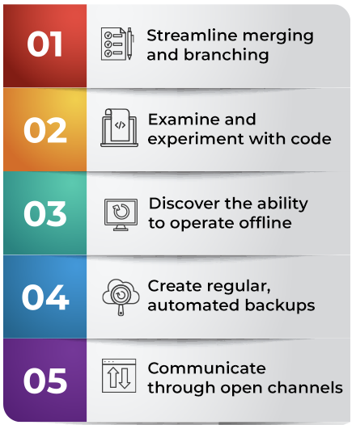
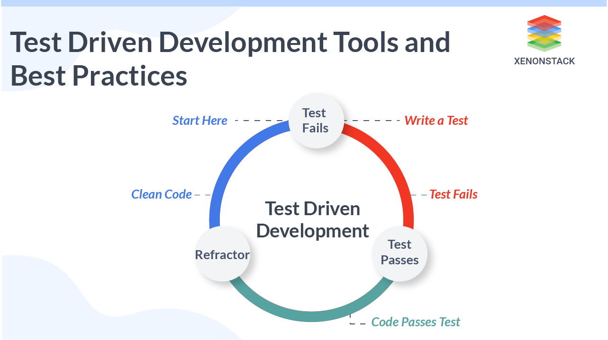
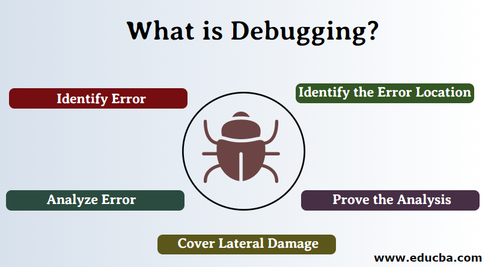
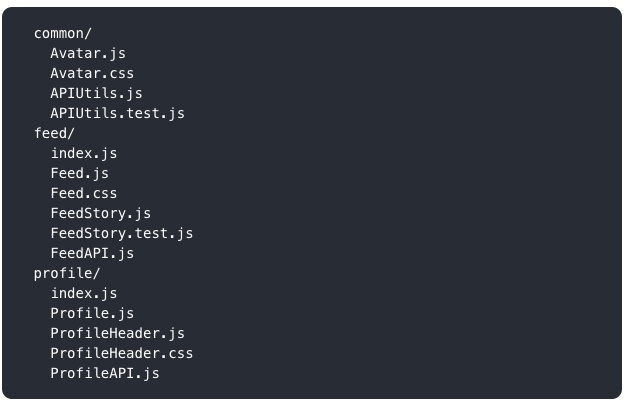
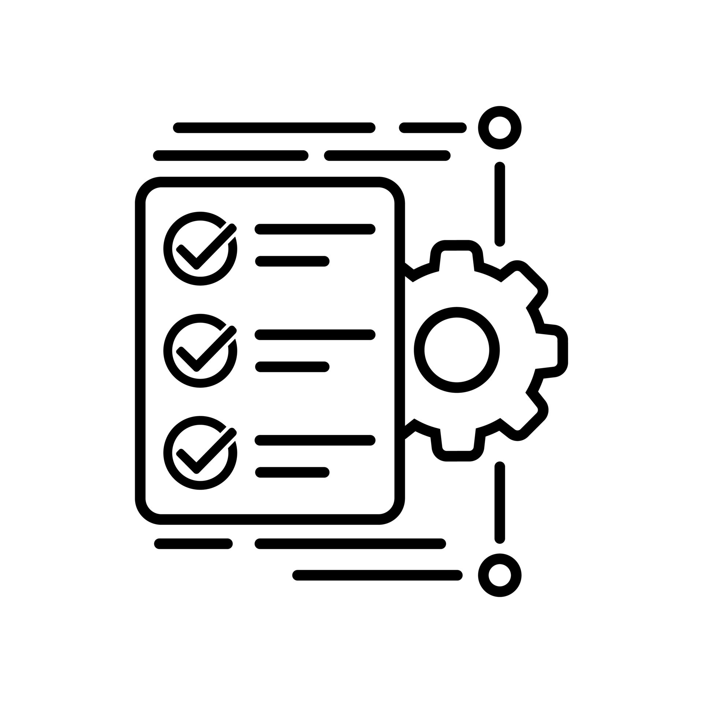
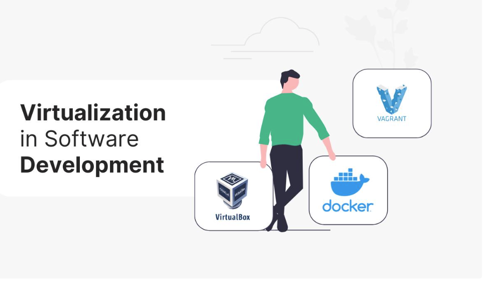
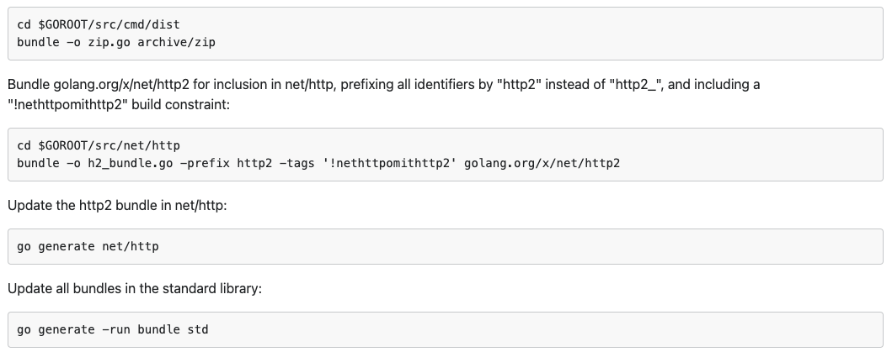
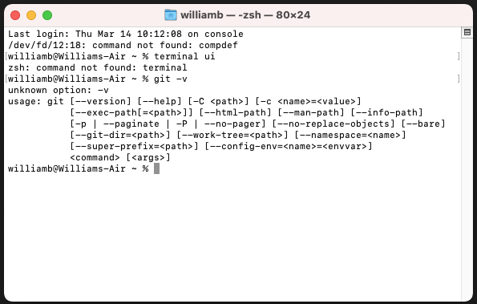
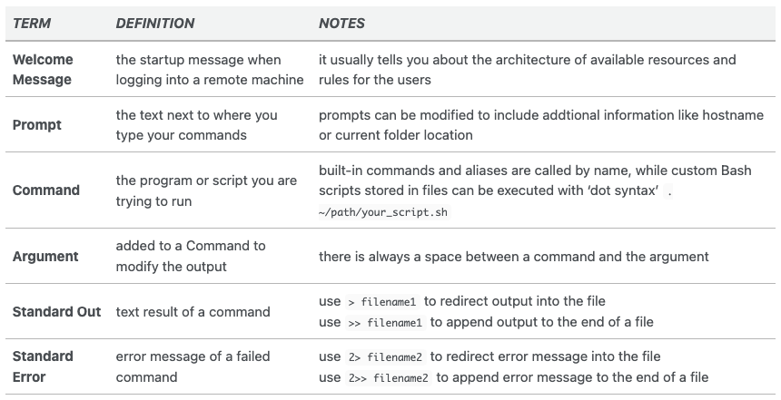

# Teorihandboken - Programmeringsmetodik (PG)

Inlämningsdatum: 20240407

Studerande: 

### William Berhane 

### FWD-23 - Chas Academy

 

## Begrepp ord:

### Automatisering:
 Att automatisera betyder att man låter en maskin eller teknik utföra ett arbete. Det kan också definieras som införande av steg i en process som gör att processen mer eller mindre går av sig själv. Majoriteten av den automatisering som skett fram till idag bygger på teknik eller program som utformas för att utföra en uppgift på ett förbestämt sätt. 
 
### Bundling:
 är ett begrepp inom detaljhandeln, och avser inkluderandet av mjukvara i priset för försäljningen av hårdvara. 

### Debugging:
 är ett sätt att undersöka vad som händer i ens kod medan den körs. Genom att lägga in breakpoints på specifika rader i sin kod så "pausas" körningen där och man kan se vilka värden programmets olika variabler har just då.

### Dokumentation: 
 är en samling dokument som beskriver ett föremål (till exempel en elektronisk apparat, där en instruktionsbok kan ingå i dokumentationen) eller en situation (till exempel en resa, där dokumentationen kan utgöra en reseskildring).

### Virtualisering:
 ersättande av speci­ali­serad utrustning med program som har samma funktioner, och som körs på vanliga persondatorer eller servrar.

## PG 1.1 Versionshantering (Git)

Versionshantering(Git) är ett program som håller reda på ändringar av en eller flera filer över tid så att du kan återskapa specifika versioner vid ett senare tillfälle. Versionshantering är ett system som spårar kodens framsteg över programvaruutvecklingens livscykel och dess multipla iterationer – som upprätthåller ett register över varje förändring komplett med författarskap, tidsstämpel och andra detaljer – och som också hjälper till att hantera förändringar. Den här artikeln beskriver hur versionskontroll i DevOps fungerar, de bästa verktygen och dess olika fördelar.

Processen att övervaka och hantera ändringar av programvarukod är känd som versionshantering, ibland även kallad revisionskontroll eller Source Controll Software. Programvarutekniker som kallas versionskontrollsystem hjälper programvaruutvecklingsteam att spåra ändringar i källkoden över tid.

Versionshantering system gör det möjligt för mjukvaruteam att arbeta snabbare och intelligentare i takt med att utvecklingsmiljöerna har ökat. De är fördelaktiga för [DevOps](https://www.atlassian.com/devops)-team eftersom de kommer att tillåta dem att påskynda framgångsrika distributioner och minska utvecklingstiden.

Versionshantering identifierar problemställena när utvecklare och DevOps-team arbetar samtidigt och producerar inkompatibla ändringar så att teammedlemmar kan jämföra skillnader eller snabbt avgöra vem som begick den problematiska koden genom att titta på revisionshistoriken. Innan man går vidare med ett projekt kan ett programvaruteam använda versionshantering system för att lösa ett problem.

Det första versionshantering systemet var stordatorbaserat och varje programmerare använde en terminal för att ansluta till nätverket. De första serverbaserade, eller centraliserade, versionshantering systemen som använde ett enda, delat arkiv introducerades på UNIX-system; senare gjordes dessa system tillgängliga på MS-DOS och [Windows](https://www.computerhope.com/jargon/w/windows.htm).

Varje kopia kallas a branch (en gren), och det ursprungliga programmet varifrån det härrörde är känt som trunk, baslinjen, huvudlinjen eller the master (mastern). Klient-serverarkitektur är standardmodellen för versionskontroll. En annan teknik är distribuerad versionshantering, där alla kopior förvaras i ett kodbaslager (repository), och uppdateringar görs genom att dela patchar eller modifieringar mellan peers. Versionshantering låter team arbeta tillsammans, påskynda utvecklingen, lösa problem och organisera kod på ett ställe.

### Olika sorter Versionshanteringsverktyg :

#### - [Git](https://git-scm.com/) : 
    
    Git är bland de mest kraftfulla versionshanteringsprogrammen på marknaden nu. The creator of Linux, Linus Torvalds, skapade det distribuerade versionshanteringssystemet som kallas Git. Dess minnesfotavtryck är minimalt och kan följa ändringar i vilken fil som helst. När du lägger till detta till dess omfattande funktionsuppsättning får du ett fullfjädrat versionskontrollsystem som kan hantera alla projekt. På grund av dess enkla arbetsflöde används den av Google, Facebook och Microsoft.

#### - [IBM Configuration Management Version Control (CMVC)](https://www.ibm.com/docs/en/engineering-lifecycle-management-suite/lifecycle-management/6.0?topic=management-configuration-concepts-capabilities):

    Programvara som utför programversionskontroll, konfigurationshantering och ändringshanteringsuppgifter kallas Configuration Management Version Control (CMVC). Detta system var klient-serverbaserat, med servrar för flera Unix-varianter och kommandorads- och grafiska klienter för många plattformar. Även efter att ha bytt namn på en fil kan den spåra filhistorik. Detta beror på att utvecklare kan ändra databasens filnamn och filnamnet på disken var ett nummer. Delegering av makt är möjlig tack vare dess decentraliserade administration.

#### - [Apache Subversion](https://subversion.apache.org/): 

    Ett versionskontrollsystem kallat Apache Subversion, som är gratis och med öppen källkod, gör det möjligt för programmerare att hantera både de senaste och tidigare iterationerna av viktiga filer. Den kan spåra ändringar av källkod, webbsidor och dokumentation för storskaliga projekt. Subversions huvudfunktioner är arbetsflödeshantering, användaråtkomstgränser och billig lokal förgrening. Både kommersiella produkter och enskilda projekt kan hanteras med Subversion, ett centraliserat system med många kraftfulla funktioner. Det är en av Apaches många open source-lösningar, som Apache Cassandra.
   

#### - [Azure DevOps](https://learn.microsoft.com/sv-se/azure/devops/user-guide/what-is-azure-devops?view=azure-devops):

   Du kan använda alla Azure DevOps-tjänster eller bara de du behöver för att förbättra ditt nuvarande arbetsflöde. En grupp mjukvaruutvecklingstekniker som du kan använda tillsammans är Azure DevOps Server, tidigare Team Foundation Server (TFS). Förutom åtkomstkontroller och behörigheter är buggspårning(bug tracking), byggautomatisering(build automation), ändringshantering, samarbete, kontinuerlig integration och versionskontroll alla delar av källkodshanteringsprogrammet som kallas Azure DevOps Server. 

#### - [Concurrent Versions System (CVS)](https://www.ibm.com/docs/en/tivoli-netcoolimpact/7.1?topic=steps-using-concurrent-versions-system-cvs):

   Ett av de första versionskontrollsystemen som utvecklades, CVS är ett välkänt verktyg för öppen källkod och kommersiella utvecklare. Du kan använda den för att checka in och ut koden du tänker arbeta med. Team kan integrera sina kodändringar och lägga till utmärkande funktioner till projektet. CVS använder deltakomprimering för att effektivt komprimera versionsskillnader och en klient-serverarkitektur för att hantera ändringsdata. I större projekt sparar det mycket diskutrymme.

#### - [Mercurial](https://www.mercurial-scm.org/):

   Utvecklare och företag avgudar Mercurial för dess sökmöjligheter, säkerhetskopieringssystem(backup system), dataimport och -export, projektspårning och hantering(project tracking and management) och datamigreringsverktyg. Det kostnadsfria hanteringsprogrammet för källkontroll Mercurial stöder alla populära operativsystem. Det är en distribuerad versionslösning och kan enkelt hantera projekt av alla storlekar. Genom tillägg kan programmerare snabbt utöka den inbyggda funktionaliteten(built-in functionality). För mjukvaruingenjörer görs källrevidering enklare genom dess användarvänliga och intuitiva gränssnitt(intuitive interface).

#### - [Github](https://www.techtarget.com/searchitoperations/definition/GitHub):

   Programvaruutvecklingsteam kan samarbeta och hålla reda på alla kodändringar med GitHub. Du kan hålla reda på kodändringar(Code modification), gå tillbaka i tiden för att rätta till misstag och samarbeta med andra teammedlemmar. Den mest pålitliga, säkra och skalbara utvecklarplattformen i världen är GitHub. Du får de bästa resurserna och tjänsterna för att hjälpa dig att skapa de mest avancerade gemenskaperna som möjligt. Den mest pålitliga, säkra och skalbara utvecklarplattformen i världen är GitHub.

#### - [AWS CodeCommit](https://docs.aws.amazon.com/codecommit/latest/userguide/welcome.html):

   Privata Git-förråd(Git-repositories) är värd för det hanterade versionskontrollsystemet AWS CodeCommit. Den integreras smidigt med andra Amazon Web Services (AWS)-produkter, och koden lagras i säkra AWS-inställningar. Därför är det en lämplig passform för AWS nuvarande användare. Tillgång till olika användbara plugins från AWS-partner görs också tillgänglig genom AWS-integration, vilket hjälper till med programutveckling. Du behöver inte oroa dig för att underhålla eller skala ditt källkontrollsystem (Source control system)när du använder CodeCommit.

#### - [Bitbucket](https://bitbucket.org/):

   Som en komponent i Atlassian-programfamiljen kan Bitbucket kopplas ihop med andra Atlassian-produkter som HipChat, Jira och Bamboo. Några av Bitbuckets nyckelfunktioner är kodgrenar(code branches), in-line kommentarer och debatt, och pull-förfrågningar(Pull-request). Företagets datacenter, en lokal server eller molnet kan alla användas för dess distribution. Med Bitbucket kan du fritt ansluta till upp till fem personer. Detta är fördelaktigt eftersom du kan använda plattformen utan att spendera några pengar.

#### - [RhodeCode](https://rhodecode.com/):

   RhodeCode är en plattform för att hantera offentliga arkiv(public repositories). RhodeCode erbjuder en modern plattform med enhetlig säkerhet och verktyg för alla versionskontrollsystem, i motsats till gammaldags källkodshanteringssystem eller Git-only-verktyg. 
   Plattformen är designad för företagssystem bakom brandväggen som kräver höga säkerhetsnivåer, sofistikerad användarhantering och standardautentisering. RhodeCode har ett bekvämt installationsprogram, det kan användas som ett fristående värdprogram på din server, och dess Community Edition är obegränsat gratis.

#### - [Computer Associates Panvalet](https://www.ibm.com/docs/en/raa/6.1?topic=systems-making-panvalet-available):

   CA Panvalet etablerar och underhåller ett kontrollbibliotek med källprogram(controll library of source programs), centraliserar lagringen av källkoden och erbjuder snabb åtkomst för underhåll, kontroll och skydd mot förlust, stöld och andra faror. Precis som Microsoft Visual SourceSafe för persondatorer är Panvalet ett proprietärt system med slutet kodkäll(closed-source) för kontroll och versionshantering av källkod. Användare checkar ut filer för att redigera och checkar sedan tillbaka dem i förvaret med hjälp av en klient-serverarkitektur.

#### - [Helix Core](https://www.perforce.com/products/helix-core/free-version-control):

   Det erbjuder den enda källan till noggrannhet för all utveckling. Företaget bakom det är Perforce Software Inc. Det är ett nätverksanslutet klient-server revisionsverktyg. Den stöder flera operativsystem, inklusive OS X, Windows och Unix-liknande plattformar. Detta verktyg används främst i storskaliga utvecklingsuppställningar. Genom spårning och hantering av ändringar av källkod och annan data effektiviserar det utvecklingen av komplicerade produkter. Dina konfigurationsändringar förgrenas och slås samman med strömningsfunktionen.

#### - [GNU Bazaar](https://web.archive.org/web/20230506175749/http://bazaar.canonical.com/en/):

   GNU Bazaar (tidigare Bazaar-NG Canonical) är ett kommandoradsverktyg av företaget som skapade Ubuntu, och det är ett distribuerat revisionskontrollsystem för klient-server. Många samtida projekt använder den, inklusive MySQL, Ubuntu, Debian, Linux Foundation och Debian. GNU Bazaar är verkligen plattformsoberoende och körs på alla versioner av Linux, Windows och OS X. Hög lagringseffektivitet, stöd för offlineläge och stöd för externa plugin är några av GNU Bazaars bästa egenskaper. Dessutom möjliggör det ett brett utbud av utvecklingsarbetsflöden.

### Fördelarna med Versionshantering 

- Effektivisera sammanslagning och förgrening (Streamline merging and branching)
- Undersök och experimentera med kod (Examine and experiment with code)
- Håll reda på alla ändringar som görs i koden (Keep track of every change made to the code)
- Få tillgång till varje fils hela långsiktiga ändringshistorik ( Access every file’s entire long-term modification history )
- Upptäck möjligheten att arbeta offline (Discover the ability to operate offline )

- Skapa regelbundna, automatiserade säkerhetskopior (Create regular, automated backups) 
- Kommunicera genom öppna kanaler ( Communicate through open channels)
- Generera ledningssammanfattningar (Generate management summaries)
- Följ Reglerna (Stay compliant with regulations)
- Öka utvecklarens produktivitet (Boost developer productivity)
- Minska fel och dubbelarbete (Reduce error and duplication )

## PG 1.2 Benchmarking

Benchmarking är en process som används för att mäta kvaliteten och prestanda för ditt företags produkter, tjänster och processer. Dessa mätningar har inte så mycket värde i sig själva – att data måste jämföras mot någon sorts standard. Ett riktmärke(benchmark).

Anta till exempel att det tar 30 minuter att producera din produkt. Är 30-minutersmätningen bra eller dålig? Det enda sättet för dig att veta är att jämföra med andra data, till exempel den tid det tar en annan organisation att producera en liknande produkt. Om en annan organisation kan producera samma typ av produkt på mindre än 30 minuter kan du använda deras tid som riktmärke för att mäta dina egna processer och procedurer.

Målet med benchmarking är att använda data som samlats in i din benchmarkingprocess för att identifiera områden där förbättringar kan göras genom att:

Att avgöra hur och var andra företag uppnår högre prestationsnivåer än vad ditt företag har kunnat uppnå.
Att jämföra tävlingens processer och strategier mot dina egna.
Använd informationen du samlar in från dina analyser och jämförelser för att implementera förändringar som kommer att förbättra ditt företags prestanda, produkter och tjänster.
Vanliga områden som du kanske vill rikta in dig på för benchmarkinganalys inkluderar kostnad per enhet, tid att producera varje enhet, kvalitet på varje enhet och kundnöjdhet. De resultatmått du får från dessa mål kan jämföras med andra för att hjälpa dig att fastställa bästa praxis för att förbättra din verksamhet.

### Varför är benchmarking viktigt?
Målet med ditt företag bör vara att växa, förbättra processer, öka kvaliteten, minska kostnaderna och tjäna mer pengar. Benchmarking är ett av många verktyg du kan använda som en del av alla ständiga förbättringsmodeller som används inom din organisation.

Konsekvent benchmarking kan hjälpa dig:

- Förbättra processer och rutiner.
- Mät effektiviteten av tidigare prestationer.
- Ge dig en bättre uppfattning om hur tävlingen fungerar, vilket hjälper dig att identifiera bästa praxis för att öka prestandan.
- Öka effektiviteten och sänka kostnaderna, vilket gör ditt företag mer lönsamt.
- Förbättra kvalitet och kundnöjdhet.

### Olika typer av benchmarking

Det finns många olika typer av benchmarking som delas in i tre primära kategorier: intern, konkurrenskraftig och strategisk.

#### Intern benchmarking
Om andra team eller organisationer inom ditt företag har etablerat bästa praxis i processer som liknar din, innebär intern benchmarking att analysera vad de gör så att du kan hitta områden där du kan förbättra och bli mer effektiv.

Du kan till exempel jämföra prestandan för en lager- och fraktplats med en annan lager- och fraktplats. Sajten med överlägsen prestanda behöver helt enkelt dela sina processer och rutiner så att hela företaget drar nytta av ökad prestanda.

#### Konkurrenskraftig benchmarking
Denna typ av benchmarking är en jämförelse av dina direkta konkurrenters produkter, tjänster, processer och metoder. Denna typ ger dig insikt i din position inom din bransch och vad du kan behöva göra för att öka produktiviteten.

Du kan till exempel jämföra kundnöjdheten för en konkurrents produkt med din. Om din konkurrent får bättre kundrecensioner måste du analysera vad skillnaden är och ta reda på hur du kan förbättra kvaliteten på din produkt.

#### Strategisk benchmarking
Använd den här typen av benchmarking när du behöver se bortom din egen bransch för att identifiera prestanda och bästa praxis i världsklass så att du kan leta efter sätt att anpassa deras metoder till dina procedurer och processer.

### Steg i benchmarkingprocessen

- #### Välj ett ämne att jämföra
Vad man ska benchmarka är lika viktigt som hur man benchmarkar det. Chefer och andra ledande befattningshavare bör vara involverade i att bestämma vilka processer som är avgörande för företagets framgång. Prioritera processerna utifrån vilka mätetal som är viktigast för alla intressenter, med betoning på processer eller funktioner som är lätta att kvantifiera. Efter prioritering, välj och definiera de åtgärder du vill samla in.

- #### Bestäm vilka organisationer eller företag du vill jämföra
Bestäm om du ska benchmarka processer inom ditt eget företag, en konkurrent eller ett företag utanför din bransch.
Det kan vara svårt att samla in all data du vill ha om du jämför en direkt konkurrent. Så du bör välja flera olika organisationer att studera för att få den data du behöver. Samla information från flera källor för att få den mest detaljerade informationen om den organisation du väljer att studera.

- #### Dokumentera dina nuvarande processer
Kartlägg dina nuvarande processer så att du kan identifiera områden som behöver förbättras och lättare jämföra mot den valda organisationen.

- #### Samla in och analysera data
Det här steget är viktigt – men det kan visa sig vara svårt när du försöker samla in data från en konkurrent eftersom mycket av den informationen kan vara konfidentiell. Samla information genom research, intervjuer, tillfälliga samtal med kontakter från de andra företagen och med formella intervjuer eller enkäter.
Du kan också samla in sekundär information från webbplatser, rapporter, marknadsföringsmaterial och nyhetsartiklar. Sekundär information kanske inte är lika tillförlitlig.
När du har samlat in tillräckligt med data, samla alla intressenter för att analysera datan.

- #### Mät din prestation mot den data du har samlat in
Titta på den data du har samlat in sida vid sida med den statistik du samlat in från din analys av dina egna processer. Du kanske vill lägga dina prestationsmått ovanpå dina processdiagram eller kartlägga din konkurrents processer för att lättare se var du hamnar efter.
När du analyserar jämförelserna, försök att identifiera vad som orsakar luckorna i din process. Till exempel, har du tillräckligt med människor och är de tillräckligt utbildade för att utföra tilldelade uppgifter? Kanske finns det flera steg som kan automatiseras eller kombineras för att effektivisera arbetsflödet. Brainstorma idéer för att effektivt och effektivt fylla dessa luckor.

- #### Skapa en plan
Skapa en plan för att implementera överenskomna förändringar som du har identifierat som de bästa för att täppa till prestandaluckor. Implementering kräver totalt inköp uppifrån och ner. Din plan måste innehålla tydligt definierade mål och bör vara skriven med företagets kultur i åtanke för att hjälpa till att minimera eventuella återkopplingar du kan få från anställda.

- #### Implementera ändringarna
Övervaka noggrant förändringarna och de anställdas prestationer. Om nya processer inte fungerar smidigt som förväntat, identifiera områden som behöver justeras. Se till att alla anställda förstår sina jobb, är välutbildade och har expertis för att utföra sina tilldelade uppgifter.
Dokumentera alla processer och se till att alla anställda har tillgång till dokumentation och instruktioner så att alla är på samma sida och arbetar mot samma mål.

- #### Upprepa processen
Efter att ha framgångsrikt implementerat en ny process är det dags att hitta andra sätt att förbättra. Benchmarkingprocessen är en av ständiga förbättringar och iterationer. Granska de nya processerna du har implementerat och se om det finns några ändringar som behöver göras. Om allt fungerar som det ska, titta till andra områden eller mer ambitiösa projekt som du kanske vill jämföra och starta processen igen.
När du korrekt implementerar och följer den kontinuerliga praxisen för benchmarking kommer ditt företag att växa och du kommer att hänga med (eller till och med överträffa) dina konkurrenter.

## PG 1.3 Testdriven utveckling
 Test Driven Development eller TDD som det är känt i utvecklarkretsarna är en viktig aspekt av mjukvaruutvecklingsprocessen. Genom detta tillvägagångssätt är det lättare att testa vad en specifik kod skulle utföra. Testfall för varje funktionalitet i programvaran skapas, och när en viss funktionalitet misslyckas i ett test skulle koden omarbetas och nya koder skapas. Den nya koden måste också klara testet och vara buggfri. Utvecklaren måste bara skriva en ny kod om det automatiska testet för koden har misslyckats, så det kommer att finnas ett testfall för varje funktionalitet, hur liten som helst. Och TDD handlar om att designa och utveckla tester för varje funktion i applikationen.
Namnet Test Driven Development indikerar att det är processen att göra tester på rätt sätt som driver mjukvaruutvecklingen. Därför härstammar själva processen från Agile metodik och extrem programmering. Denna process säkerställer att utvecklare skapar och underhåller kod som är motståndskraftig och långsiktig.
Så processen för TDD skulle vara att skriva enhetstestet först, och om testet misslyckas, implementera sedan kodändringarna. Detta hjälper också till att undvika dubblering av kod. Det hela går på att skriva och korrigera misslyckade tester innan själva utvecklingen. För att TDD ska fungera framgångsrikt är det dock lämpligt att skriva testfallen till enkla testfall. För komplex affärslogik skulle det vara riktigt svårt att skriva en kombination av testfall och uppnå full framgång. Det finns en chans att du kanske missar att skriva några tester, så det är inte en lätt uppgift alls.

#### Skillnad mellan TDD och traditionell testning

Traditionell testning är mer tidskrävande än TDD och baseras på upprepningen av en kort utvecklingscykel. Först skrivs testet från början, sedan skrivs programkoden, följt av systemets önskade beteende. När det skriftliga testet har godkänts (kontroll av att den oskrivna kodens arbete är korrekt) utförs refaktorering av den skrivna koden.
Inledningsvis kommer TDD också att vara tidskrävande, men med tiden kommer utvecklaren att vänja sig vid det eftersom utvecklingsprocessen kommer att bli mer strukturerad. Till exempel, när du anlitar en utvecklare kommer de att bestämma vad de ska skriva och sedan hur de ska skriva det.
Traditionell testning är framgångsrik när den korrekt hittar en eller flera defekter. Precis som TDD. Att hitta defekter är faktiskt ett bra tecken för då vet du att du måste lösa vad som är fel och gå vidare därifrån. TDD ger dig också mer självförtroende när du släpper programmet och ser till att det uppfyller de krav som det definieras för.
I traditionell testning är fokus mer på testfallets design, medan i TDD är fokus mer på produktionskod för att verifiera om testet fungerar enligt planen.
TDD ger dig 100% testtäckning, där testning görs för varje kodrad, det är inte fallet med traditionell testning.
När projektomfånget är riktigt stort måste du vara riktigt noggrann när du utför testerna. Och det finns en chans att testet kan bli försenat och passera budgeten och tidsbegränsningarna.
TDD kan vara svårt att skriva, och det kan bromsa utvecklingstiden, men det skulle definitivt löna sig i längden.
En annan nackdel med TDD är att konceptet är svårt att tillämpa på befintlig äldre kod.
Det är alltid bra att testet misslyckas innan du släpper ett projekt, för då vet du att du har kört ett giltigt test. Genom TDD vet du att ditt system uppfyller de krav som det är utformat för. Så fokus ligger mer på produktionskod för TDD, eftersom det säkerställer om testet kommer att fungera korrekt. Och när programvaran uppfyller alla krav som är avsedda för den.

#### De olika stadierna i en testdriven utveckling

Det finns tre olika stadier av TDD: Röd, grön och Refactor
Följ denna stegordning säkerställer att du har tester för koden du skriver, så du måste bara skriva koder för de tester du gör.

#### Den röda scenen

Tanken med det röda stadiet är att få testet att misslyckas, och den svåraste fasen också eftersom den utvecklas måste skriva test mot ingen kod. Nya utvecklare måste ha svårt eftersom de skulle vara förvirrade om vad de ska testa utan att ha koden för det. Men det är en vanlig sak och med erfarenhet kommer det att bli smidigt. Det första testet skrivs utan att skriva kod och för att deklarera klass och metod, och testet kommer att ha kompileringsfel. Nästa steg skulle vara att fixa kompileringsfelet och köra testet för att misslyckas. Detta orsakar den röda flaggan.

#### Den gröna fasen

Efter det röda steget skulle nästa steg vara att skriva koden. Denna kod måste klara det första testet. Att bara skriva tillräckligt med kod för att se till att bara det första testet klarar sig är ett hinder som många utvecklare står inför. För i nästa test måste det misslyckas, följt av ny kod för att skicka dem.

#### Refraktor -fasen 

I de två första stadierna, där testet först måste misslyckas och sedan klara det, var målet att sedan få testerna att klara. Men i Refractor -fasen måste andra faktorer beaktas som kodkvalitet, kodunderhållbarhet, kodläsbarhet etc. Fokus här är alltså på dessa aspekter, så enhetstesterna kommer att fokusera på dessa. I ombyggnadsfasen behöver du inte oroa dig för saknad funktionalitetsaspekt, för när kodändringarna sker kommer testfallen automatiskt att överensstämma med funktionalitetsdelen också.

#### TDD passar väl in i Agile -metodiken 

Det är helt uppenbart att projektkraven kan ändras långt in i utvecklingsstadiet, så att ha TDD i samarbete med Agile utveckling kommer definitivt att göra det framgångsrikt och bygga projekt som är anpassade till kundernas krav. Med testdriven utveckling får du en tidigare feedback på projektet som du enkelt kan arbeta med.
Det skulle också hjälpa till att förutse och minska de kritiska flaskhalsarna och säkerställa att projektet går vidare som avsett. Utvecklarteam kan spara mycket tid eftersom testerna skapas mycket tidigare i projektutvecklingen, och de behöver inte oroa sig för omfattande testskript.

#### Tillslut 

Testdriven utveckling är en teknik som verkligen är tidskrävande, men den är värdefull i den meningen att den hjälper till att driva ditt projekt i rätt riktning genom att få korrekt feedback om projektet och upptäcka buggar. Det är dock ett mycket bättre alternativ än traditionella tester eftersom det kräver mer tid och pengar.

## PG 1.4 Deploy och staging

Staging och deploy är processen att konfigurera ett stort antal IT-tillgångar samtidigt på en central plats. Detta möjliggör snabb distribution till dina kontor, butiker och datacenter så att de kommer till platsen redo att användas. En enskild staging och implementeringshändelse består av många mindre händelser som fungerar i harmoni. Verifiering av IT-tillgångar, laddning av programvara, testning, staging, anpassning och kitning spelar en viktig roll.
Deploysprocessflödet består av 5 steg: Planering(Planning), utveckling(Development), testning(Testing), driftsättning(Deploying) och övervakning(Monotoring).

#### Fördelar med staging and deploy

- #### Expediency (Ändamålsenlighet)
 
   Upplev färre projektförseningar och omfattningskrypning när staging och integration sker i en kontrollerad miljö, oberoende av dina platser på plats.

- ####  Plug and Play (Skalbarhet)  

   Din teknikstack kommer "plug and play" till varje plats. Du sparar tid, pengar, fysiskt utrymme och upplever färre problem på fältet.

- ####   Scalability () 

   Att deploy och installera teknik för nya butiker, kontor, datacenter, lager och distributionscenter är systematiskt, repeterbart och skalbart.

### Stagingmiljö

En stagingsmiljö är det sista steget innan något går i produktion och är synligt på livesajten.

En stagingssajts huvudsakliga syfte är att säkerställa att alla nya ändringar som implementerats från tidigare miljöer fungerar som avsett innan de når livewebbplatsen. Genom att använda en iscensättningssida och testa allt innan du distribuerar till en livewebbplats kommer du att kunna eliminera buggar och problem, så att de aldrig påverkar användaren. Ibland kallas denna process för kvalitetsbedömning (QA).

För byråer som utvecklar webbplatser för kunder, används ofta en stagingsplats för att presentera slutprojektet för kunden för att göra sluttestning och eventuellt godkännande innan en lansering.

#### Skillnaden mellan deploy och staging 

När vi bygger ett nytt paket(new package), eller uppdaterar ett paket, använder vi en testserver för att kontrollera om allt fungerar korrekt, om paketet drar rätt beroenden och om paketet gör något dumt. Paket som gör dumma saker har förekommit tidigare, det är därför den virtuella datorn har en litte 2 istället för en 1 i slutet av sitt namn nu, och det är just därför den här stagingsservern finns. När hela paketet fungerar korrekt kan vi markera paketet som stabilt och distribuera det på hela servrar.

Våra liveapplikationer fungerar på liknande sätt. Vi staging dem på testservrar först för att se om något hemskt händer, efteråt distribuerar vi dem på några servrar med lågt värde för att se om dåliga saker händer och slutligen rullar vi ut det överallt.

Målet med alla dessa stagingsprocessen är att minska risken. Uppdateringen kan förstöra din produktionsdatabas på något sätt, din implementering kan förstöra och förlänga stilleståndstiden för din applikation, du kanske har missat viktiga funktionella buggar. Att staga applikationen i en miljö med lågt värde isolerar först effekten av ett misstag och minskar därmed risken för hela distributionen.

## PG 1.5 Debugging

Debugging är processen att spåra och eliminera problem i programvaror som buggar och sårbarheter som kan uppstå på grund av dålig kodning, arkitektur eller implementering. Det är vanligtvis förknippat med användningen av spårnings- och analysverktyg som kan exekvera vår kod steg-för-steg och tillåta oss att undersöka programtillståndet medan det är avstängt.
Debugging kan också åstadkommas på många andra sätt, inklusive instrumentering av vår kod för att producera extra artefakter, såsom loggning, exekvering i små, kontrollerade enheter (testning) eller att undersöka koden statiskt (kodgranskning och statisk analys).
Vi kommer att titta på några av verktygen och teknikerna senare i den här artikeln. Hur du än gör det, när du har spårat grundorsaken, är nästa jobb att rätta till koden och fixa felet.
Fixeringen bör sedan testas för att verifiera att den verkligen är fixad (detta kan vara genom att bara upprepa samma felsökningssteg som isolerade den från början).
Helst bör vi hitta och fixa kodproblem eftersom koden skrivs i de integrerade utvecklingsmiljöerna [(IDEs)](https://www.redhat.com/en/topics/middleware/what-is-ide).

 

### Varför är felsökning viktigt?

Felsökning är en avgörande komponent i mjukvaruutveckling eftersom buggar kan få ett program eller system att misslyckas, resultera i dålig prestanda eller till och med felaktiga mätningar och resultat. Felsökningsprocessen kan vara tidskrävande och delas upp i flera komplexa iterativa processer för att identifiera och korrigera felen i koden. Det är dock viktigt att se till att systemet och programmet fungerar korrekt. Helst ska programvaran fungera som den är designad och inte innehålla några buggar innan den senaste uppdateringen släpps på marknaden, samtidigt som den högsta kvaliteten på kod och prestanda bibehålls.
Vår värld körs på mjukvara och källkod. Varje företag har nu blivit ett teknikföretag med sin egen teknikstack.
För att förbli konkurrenskraftigt måste varje företag förbli top of mind och ge upplevelser på toppnivå.
Buggy eller problematisk kod resulterar i en dålig användarupplevelse som reflekterar dåligt på verksamheten och avskräcker användare. När det gäller felsökning är det viktigt att etablera en definitiv process för att spåra och kommunicera buggar så att de framgångsrikt kan hanteras och åtgärdas.

### Hur fungerar debugging?

Kod- och mjukvarufelsökning innebär att identifiera och lösa problem, fel eller oväntade beteenden inom ett program för att säkerställa att det fungerar som avsett. Det är en avgörande del av mjukvaruutvecklingen, vilket säkerställer tillförlitligheten, funktionaliteten och kvaliteten på slutprodukten. Felsökning börjar med att identifiera symptom, såsom programkrascher, oväntade utdata eller felaktigt beteende. Utvecklare använder ofta bygg- och körtidsverktyg för att lokalisera var problemet kan ligga. När symtomet upptäcks försöker utvecklare att isolera den specifika kodsektionen eller komponenten som orsakar problemet.
Olika felsökningsverktyg, såsom linters i IDE, felsökare, loggningsmekanismer eller specialiserad programvara, hjälper utvecklare att inspektera variabler, stega igenom koden och identifiera problem på olika nivåer.
Kodfelsökning fungerar vanligtvis genom att gradvis stega igenom exekveringen av din kod tills du hittar punkten där felet inträffar. Därifrån bör du börja arbeta med hur du fixar koden. Hur en kodfelsökning fungerar kommer att variera beroende på vad du felsöker, språket och systemet som används. Att identifiera buggar kan göras enklare genom att titta på kodens loggning och använda fristående felsökningsverktyg eller ett felsökningsläge inom en IDE.

### Vad är debuggingsverktyg och programvara?

Felsökningsverktyg är program som används för att identifiera, testa och felsöka problem av andra program. Dessa verktyg ger ett systematiskt tillvägagångssätt för felsökning och felsökning av programvara, och ger detaljerad information om programmets körning, minnesanvändning, variabler och andra relevanta data.
Detta gör att programmeraren kan titta på implementeringen och se de förändringar som sker som kan manifestera sig i att koden misslyckas.

### Debuggers

Debuggers är distinkta verktyg som ger utvecklare möjlighet att se och kontrollera hur deras program körs. En debugger låter dig ställa in en brytpunkt i din kod, normalt genom att markera en kodrad, och när programmet körs i felsökningsläge kan felsökaren avlyssna programmet och stoppa exekveringen. När exekveringen har stoppats kan du inspektera värdena för variabler vid den punkten och sedan gå vidare genom koden steg för steg och övervaka programmets tillstånd tills du upptäcker var buggen är. Dessutom tillhandahåller debuggers funktioner som hjälper programmerare att spåra och förstå exekveringen av kod samt lokalisera grundorsakerna till ovanligt beteende eller misslyckanden. Även om det finns fristående debuggers tillgängliga, inkluderar vissa IDE, som Visual Studio, inbyggda debuggers.

Några vanliga interaktiva debuggers inkluderar:

- GDB (GNU Debugger)
- LLDB (lågnivåfelsökning)
- WinDbg (Windows Debugger)
- Visual Studio Debugger
- IntelliJ IDEA Debugger
- PyCharm Debugger

## PG 1.6 Dokumentation

### Vad är dokumentation?

Dokumentation är skriven text eller illustration som ger information om en applikation eller annan mjukvaruprodukt. Dokumentation är viktig för att förklara hur programvaran fungerar, hur man använder den och all annan information som kan vara till hjälp för användare eller utvecklare.

Programvarudokumentation kan ta olika former, inklusive användarmanualer, tekniska manualer, onlinehjälpfiler och API-dokumentation. Den skapas vanligtvis av tekniska skribenter och utvecklare och är utformad för att vara tydlig, koncis och korrekt.

Syftet med dokumentationen är att ge användarna den information de behöver för att effektivt använda och förstå programvaran. Den kan också användas av utvecklare som en referens vid modifiering eller uppdatering av programvaran.

Dokumentation är en avgörande del av mjukvaruutvecklingsprocessen, eftersom den hjälper till att säkerställa att utvecklarna och användarna enkelt kan förstå programvaran och att produkten uppfyller användarnas behov. Det hjälper också till att förbättra programvarans övergripande kvalitet genom att tillhandahålla en tydlig och heltäckande referens för utvecklare och användare.

### Varför är dokumentation(Software documentation) viktig?

Programvarudokumentation är viktigt av flera skäl. Här är några av de viktigaste fördelarna med att dokumentera programvara:

- Förbättrad användbarhet (ImprIoved usability)
- Förbättrat underhåll och support (Enhanced maintenance and support)
- Ökat samarbete (Increased collaboration)
- Efterlevnad av föreskrifter (Compliance with regulations)

### Typer och exempel på mjukvarudokumentation

Programvarudokumentation kan ta olika former beroende på dess målgrupp. Nedan listas några vanliga exempel:

### Extern dokumentation

#### Slutanvändardokumentation

Slutanvändardokumentation är dokumentation som är avsedd för slutanvändarna av en mjukvaruprodukt. Den är vanligtvis utformad för att vara lätt att förstå och använda och kan innehålla användarmanualer, instruktionsdokument, vanliga problem och lösningar och andra typer av dokumentation som förklarar hur användare kan få ut det mesta av programvaran.
Slutanvändardokumentation tillhandahålls vanligtvis till användare innan de börjar använda programvaran och är utformad för att hjälpa dem att använda den. Det kan innehålla information om programvarans funktioner och funktioner, samt steg-för-steg-instruktioner för hur du använder programvaran.
Slutanvändardokumentation är en viktig aspekt av mjukvaruutvecklingsprocessen, eftersom den hjälper till att säkerställa att användarna har den information de behöver för att effektivt använda och förstå programvaran. Den skapas ofta av tekniska skribenter och utvecklare och är utformad för att vara tydlig, koncis och korrekt.
Denna typ av dokumentation finns för praktiskt taget varje produkt, oavsett dess målgrupp, och ses som en nödvändig del av leveransen av en produkt till marknaden.

#### API dokumentation

API-dokumentation är dokumentation som ger information om hur man använder ett programbibliotek eller API (Application Programming Interface) effektivt. Det innehåller vanligtvis beskrivningar av de olika klasserna, metoderna, metodargumenten och egenskaperna som finns tillgängliga i biblioteket, tillsammans med exempel på hur man använder dem.
API-dokumentation tillhandahålls vanligtvis i ett format som är lätt för utvecklare att läsa och förstå, som HTML eller PDF. Det kan också inkludera en interaktiv lekplats för att testa API:et.
Det är en viktig resurs för utvecklare som arbetar med ett visst API, eftersom det hjälper dem att förstå hur API:et fungerar och hur man använder det effektivt i sin egen kod.

#### Just-in-time dokumentation

Just-in-time (JIT) dokumentation är dokumentation som tillhandahålls till användare endast när de behöver det. Det är ofta i form av kontextkänslig hjälp eller verktygstips som dyker upp när en användare utför en specifik åtgärd eller kommer åt en viss funktion i programvaran.
JIT-dokumentationen är utformad för att ge användare information och hjälp när de behöver det, snarare än att tillhandahålla en omfattande manual eller guide i förväg. Det kan vara till hjälp för användare som är bekanta med programvaran och bara behöver hjälp med specifika uppgifter eller funktioner.
JIT-dokumentation tillhandahålls vanligtvis i själva programvaran och kan vara i form av popup-fönster, verktygstips eller andra typer av sammanhangskänslig hjälp. Den används ofta tillsammans med andra typer av dokumentation, såsom användarmanualer eller onlinehjälpfiler, för att ge användarna den information de behöver för att effektivt använda programvaran.

### Intern dokumentation

#### Administrativ dokumentation

Administrativ dokumentation är dokumentation som avser administration och hantering av en mjukvaruprodukt. Det kan innehålla dokumentation om ämnen som installation, konfiguration, underhåll och support.
Administrativ dokumentation är vanligtvis avsedd för teknisk personal, såsom systemadministratörer och supportpersonal, som ansvarar för att installera, konfigurera och underhålla programvaran. Det kan innehålla instruktioner för att installera programvaran, konfigurera den för att möta organisationens behov och felsökning av vanliga problem.
Administrativ dokumentation hjälper till att säkerställa att programvaran installeras och konfigureras korrekt och att den kan underhållas och stödjas effektivt. Det kan också vara användbart för användare som behöver förstå de tekniska kraven för att använda programvaran.

#### Utvecklardokumentation

Utvecklardokumentation är dokumentation som är avsedd för mjukvaruutvecklare och andra intressenter som vill förstå den tekniska sidan av produkten. Det används vanligtvis för att dokumentera design, implementering och underhåll av en mjukvaruprodukt.
Utvecklardokumentation kan ha olika former, inklusive designdokument, kodkommentarer och tekniska rapporter. Det används vanligtvis av utvecklare för att förstå hur programvaran designades och hur den fungerar, och för att underlätta kommunikation och samarbete mellan teammedlemmar.
Utvecklardokumentation hjälper till att säkerställa att programvaran är väldesignad, underhållbar och lätt att förstå. Den kan också användas för att dokumentera bästa praxis, standarder och annan viktig information om programvaran.
Utvecklardokumentation kan innehålla teknisk information om produktens arkitektur, designmönster, kodbibliotek och andra detaljer. Den är vanligtvis mer teknisk till sin natur än användardokumentation, som är avsedd för slutanvändare av programvaran.

#### Standarddokumentation

Standarddokumentation är dokumentation som beskriver de standarder, riktlinjer och bästa praxis som bör följas när man utvecklar en mjukvaruprodukt. Det kan innehålla information om ämnen som kodningsstandarder, designstandarder, teststandarder och dokumentationsstandarder.
Standarddokumentation är vanligtvis avsedd för mjukvaruutvecklingsteamet och andra intressenter, och används för att säkerställa att mjukvaran utvecklas konsekvent och med hög kvalitet. Det kan bidra till att förbättra kvaliteten och underhållbarheten av programvaran genom att fastställa tydliga riktlinjer för utveckling.

#### Kravdokumentation

Kravdokumentationen anger kraven eller behoven för mjukvarusystemet. Den används för att definiera programvarans omfattning, funktionalitet och begränsningar, och den fungerar som en grund för design och utveckling av programvaran.
Kravdokumentation skapas normalt i början av mjukvaruutvecklingsprocessen, som används för att vägleda utvecklingsteamet när de arbetar med att bygga mjukvaran. Ofta skapas denna typ av dokumentation av produktchefer. Det kan innehålla användarberättelser, acceptanskriterier, icke-funktionella och funktionella krav och annan information som beskriver programvarans kapacitet och hur den ska bete sig.
Kravdokumentation hjälper till att säkerställa att programvaran möter användarnas och intressenternas behov. Det kan också bidra till att minska risken för missförstånd eller scope creep under utvecklingsprocessen, eftersom det ger en tydlig och detaljerad beskrivning av vad programvaran är tänkt att göra.

#### Schemaläggningsdokumentation

Schemaläggningsdokumentationen beskriver schemat och tidslinjen för ett programvaruprojekt. Den innehåller vanligtvis en lista över uppgifter som måste slutföras, beroenden mellan dessa uppgifter och de resurser (t.ex. människor, utrustning) som krävs för att slutföra dem.
Schemaläggning av dokumentation är en viktig del av mjukvaruutvecklingsprocessen, eftersom det hjälper till att säkerställa att projektet håller sig på rätt spår och att alla uppgifter slutförs i tid. Det kan skapas av projektledaren eller någon annan medlem av utvecklingsteamet, och det kan uppdateras regelbundet allt eftersom projektet fortskrider.
Schemaläggningsdokumentation kan också innehålla information om budgeten för projektet, de risker och problem som måste hanteras och alla andra faktorer som kan påverka projektets tidslinje. Det används vanligtvis tillsammans med andra typer av programvarudokumentation, såsom kravdokumentation och designdokument, för att vägleda utvecklingsprocessen.

#### Mjukvarudesigndokument (SDD)

Ett mjukvarudesigndokument (SDD) är ett dokument som beskriver designen av mjukvarusystemet. Det är ett detaljerat, tekniskt dokument som beskriver programvarans arkitektur, komponenter och gränssnitt, samt designmönster och principer som användes i dess utveckling.
Syftet med en SDD är att ge en tydlig, heltäckande beskrivning av produktens design, så att den kan förstås och implementeras av utvecklingsteamet. Den skapas vanligtvis efter att kraven för programvaran har definierats, och den fungerar som en ritning för implementering av programvaran.
En SDD kan innehålla information om den övergripande strukturen och organisationen av programvaran, modulerna och komponenterna som utgör systemet, gränssnitten mellan dessa komponenter och designmönster och principer som används för att styra utvecklingsprocessen. Det kan också innehålla diagram och andra visuella representationer av mjukvarudesignen.

## PG 1.7 Struktur av kod i projekt

Att hålla din kodstruktur snygg när du programmerar erbjuder många fördelar som kan förbättra din utvecklingsprocess och din totala produktivitet. För det första, att upprätthålla en snygg kodstruktur gör din kod mer läsbar och begriplig, inte bara för dig själv utan även för andra utvecklare som kan samarbeta med dig. Denna läsbarhet underlättar felsökningsprocessen, eftersom det blir lättare att lokalisera och åtgärda fel eller göra nödvändiga ändringar.

Dessutom främjar en ren kodstruktur kod återanvändbarhet. Genom att organisera din kod i mindre, logiska enheter kan du enkelt extrahera och återanvända specifika funktioner eller moduler i olika delar av ditt program eller till och med i framtida projekt. Detta sparar tid och ansträngning, eftersom du inte behöver uppfinna hjulet på nytt varje gång du behöver en viss funktionalitet.

Dessutom möjliggör en välstrukturerad kodbas bättre långsiktig underhållsbarhet. När din kod är snyggt organiserad kan du enkelt navigera genom den, identifiera syftet med varje komponent och göra nödvändiga uppdateringar eller förbättringar utan att introducera nya buggar eller oväntat beteende. Detta minskar sannolikheten för "spaghettikod" som blir svår att förstå och underhålla med tiden.

Dessutom främjar en ren kodstruktur samarbete inom ett utvecklingsteam. När flera utvecklare arbetar med ett projekt säkerställer en konsekvent organiserad kodbas att alla kan förstå och arbeta med olika delar av programmet utan att trampa varandra på tårna. Detta förbättrar lagarbetet och minskar sannolikheten för konflikter eller förvirring.

Att investera tid i att upprätthålla en snygg kodstruktur är mycket fördelaktigt för utvecklare. Det förbättrar kodläsbarheten, främjar kodåteranvändbarhet, förbättrar långsiktig underhåll och underlättar samarbete. Så sträva efter ren kod och njut av den smidigare utvecklingsupplevelsen den ger.

## Fördelar

- Enkel kodåteranvändning – Liknande funktionalitet eller kommunikationsprotokoll kan abstraheras till delade bibliotek och direktimporteras av projekt, utan behov av en pakethanterare.

- Förenklad beroendehantering – I en miljö med flera förvar där flera projekt är beroende av ett tredjepartsberoende, kan det beroendet laddas ner eller byggas flera gånger. I en monorepo kan bygget enkelt optimeras, eftersom refererade beroenden alla finns i samma kodbas.

- Atomic commits – När projekt som fungerar tillsammans finns i separata arkiv, måste releaser synkronisera vilka versioner av ett projekt som fungerar med det andra. Och i tillräckligt stora projekt kan hantering av kompatibla versioner mellan beroenden bli ett beroendehelvete. I en monorepo kan detta problem förnekas eftersom utvecklare kan ändra flera projekt atomärt.

- Storskalig kodrefactoring – Eftersom utvecklare har tillgång till hela projektet kan refactors säkerställa att varje del av projektet fortsätter att fungera efter en refactor.

- Samarbete mellan team – I en monorepo som använder källberoenden (beroenden som kompileras från källan), kan team förbättra projekt som andra team arbetar med. Detta leder till flexibelt kodägande.

### Begränsningar och nackdelar

- Förlust av versionsinformation – Även om det inte krävs, använder vissa monorepo-byggen ett versionsnummer för alla projekt i förvaret. Detta leder till en förlust av semantisk versionering per projekt.

- Brist på säkerhet per projekt – Med delade arkiv kan tillgång till arkivet beviljas baserat på behov. En monorepo ger läsåtkomst till all mjukvara i projektet, vilket kan leda till nya säkerhetsproblem.

- Mer lagring behövs – Med delade arkiv kan du bara hämta det projekt du är intresserad av. Med en monorepo måste du vanligtvis hämta alla arkiv. Observera att det finns begränsningar för detta (som partiell hämtning).

## PG 1.8 Automatisering av arbetsflöde

Arbetsflödesautomatisering hänvisar till användningen av programvara för att slutföra vissa uppgifter och aktiviteter, utan behov av mänsklig input. Det är ett verktyg för att göra arbetet snabbare, enklare och mer konsekvent.

Genom att automatisera arbetsflöden minskar företag behovet av manuellt arbete och repetitiva uppgifter. Som ett resultat blir processer mer effektiva och arbetare spenderar mer av sin tid på värdeskapande aktiviteter. Arbetsflödesautomatisering spelar också en avgörande roll i processorkestrering.

### Exempel på arbetsflödesautomatisering

Nu när du vet vad arbetsflödesautomatisering är, låt oss se några exempel. Varje arbetsflöde innehåller vissa uppgifter eller aktiviteter som kan automatiseras, men i vilken grad ett arbetsflöde kan automatiseras varierar. Nedan följer några exempel på uppgifter som ofta hanteras av programvara för automatisering av arbetsflöden:

- E-postmeddelanden och ifyllda formulär omvandlas till serviceförfrågningar.
- Kalenderhändelser och inbjudningar skapas och skickas.
- Arbetsbelastningsfördelning efter volym, tid eller andra kriterier.
- Arbetsobjekt tilldelas/dirigeras till lämplig person.
- E-postmeddelanden eller varningar skickas när arbetsobjekt ändrar status.
- Varningar utlöses när arbetet blir sent eller närmar sig sin deadline.
- Meddelanden levereras via Slack, WhatsApp, SMS eller andra plattformar.
- Dokument eller försäljningskontrakt genereras och levereras för underskrift.
- Aviseringar skickas när godkännande eller granskning behövs.
- Data synkroniseras när ett e-postmeddelande tas emot eller ett formulär fylls i.
- Rapporter och instrumentpaneler skapas från data i arbetsflödet.

Det finns många möjligheter till automatisering i de flesta arbetsflöden. I allmänhet, om en uppgift är repetitiv, förutsägbar, enkel, schemalagd eller händer ofta, kan den automatiseras. När flera uppgifter i ett arbetsflöde slutförs av programvara, automatiseras själva arbetsflödet.

När ett arbetsflödeshanteringssystem är integrerat med andra appar och mjukvara är ännu mer komplex automatisering av arbetsflöden möjlig.

### Automatiserar arbetsflöden?

För att automatisera ett arbetsflöde måste du först förstå allt som påverkar resultatet. Detta kan kräva input från personer i ditt team som hanterar de dagliga arbetsflödesfunktionerna. När input från teamet har samlats in kommer ett arbetsflödesdiagram – oavsett om det är ett formellt diagram med flödesschemasymboler eller en lista – att skapas för att identifiera möjligheter till automatisering av arbetsflöden. Nedan finns en steg-för-steg handledning för hur man automatiserar arbetsflöden:

1. #### Definiera arbetsflödet

Innan du kan automatisera arbetsflödet måste du förstå dess start- och stopppunkter. Vad initierar arbetsflödet? När är arbetsflödet klart? Ditt arbetsflöde bör ge en diskret, räknebar utdata.

Lär dig mer om de grundläggande komponenterna i alla arbetsflöden.

2. #### Identifiera alla aktörer i arbetsflödet

När du har identifierat start- och slutpunkterna måste du koppla ihop punkterna mellan dem. Vem är involverad i arbetsflödet? Varje person som har verket i besittning – även om det bara är för att granska det eller skicka det vidare – måste redovisas.

3. #### Lista alla system, appar och verktyg

Förutom de personer som är involverade i arbetsflödet måste du också lyfta fram de system, verktyg och appar som påverkar arbetet. Till exempel samarbetsappar, delade inkorgar, databaser eller äldre komponenter som ett ERP, CRM eller HRIS. Om ditt team använder ett system för engagemang som automatisering med låg kod, se till att du redogör för dess roll i arbetsflödet.

4. #### Notera alla inmatningsvägar

Arbetsflödeshantering kan bero på information eller data från en mängd olika källor. Dessa kan vara formulär som fångar förfrågningar, e-postmeddelanden, bots, meddelanden eller data från en app eller ett system.

5. #### Var uppmärksam på alla överlämningar

De fall där ett arbetsflödesobjekt eller information byter ägare är vanliga källor till problem. Dessa kan skapa flaskhalsar eller de kan vara tillfället då uppföljningar misslyckas eller objekt stannar eftersom det inte är klart vem som ska hantera objektet härnäst.

6. #### Skapa en automationsönskelista

Nu när du har en komplett ritning för ditt arbetsflöde är det dags att skapa en lista över alla uppgifter och aktiviteter som du vill automatisera.

7. #### Bygg den blivande versionen av arbetsflödet

Nu är du redo att skapa en ny version av arbetsflödet med hjälp av det automationsverktyg du väljer. Om du använder ett lågkodsverktyg kommer du att kunna bygga arbetsflödet och ställa in dina automatiseringar med ett intuitivt visuellt gränssnitt.

8. #### Testa den blivande versionen

Innan du kan introducera det nya arbetsflödet för ditt team, se till att testa det för att säkerställa att utdata når sitt mål och att det inte finns några problem som flaskhalsar, silos eller dataläckor.

9. #### Lär dina användare

Om arbetsflödesprogramvaran du använder är ny för ditt team måste du förbereda dem för att använda det nya verktyget. Om de redan är bekanta med ditt system, vill du se till att de förstår stegen i det optimerade arbetsflödet och att de känner sig säkra på att utföra det.

10. #### Distribuera, övervaka och optimera

När du har gett ditt team grönt ljus att implementera det nyligen automatiserade arbetsflödet, börjar du det pågående arbetet med att övervaka och ibland optimera arbetsflödet för att säkerställa dess noggrannhet, effektivitet och produktivitet.

Vad du ska leta efter i programvara för automatisering av arbetsflöden
Verktygen som används för att automatisera arbetsflöden går under några namn: programvara för automatisering av arbetsflöden, programvara för hantering av arbetsflöden, arbetsflödessystem eller affärsprocessautomation (BPA). Oavsett namn, leta efter en plattform som innehåller värdeskapande funktioner och ger integrationsmöjligheter för att öka utbudet av automatiseringar du kan implementera. Några funktioner inkluderar:

#### Låg kod

Minskar mängden IT-stöd som behövs för att implementera och underhålla programvaran. Affärsanvändare kan komma åt vissa funktioner via ett intuitivt, visuellt gränssnitt. Den här funktionen gör automatisering snabbare och sätter affärsteam i en medskapande roll för att optimera arbetsflöden. Låg kod minskar också trycket på IT-eftersläpningen.

#### Blanketter och portaler

Att fånga och konsolidera inkommande data kan vara en utmaning för alla lag, och programvara för automatisering av arbetsflöden ger en lösning. Anpassningsbara formulär förenklar förfrågningshanteringen genom att standardisera processer, undvika fel och eliminera dubbeldatainmatning. Portaler gör det enkelt att organisera och säkert dela formulär med interna eller externa partners.

Informationen som samlas in via formulär kan också automatiskt omvandlas till arbetsobjekt och dirigeras till lämplig gruppmedlem för att vidta åtgärder.

#### Integrationer

De flesta team förlitar sig på en mängd olika system, databaser och appar för att hantera sina arbetsflöden och processer. Oavsett om det innebär en ERP-, CRM-, HRIS- eller punktlösningar som har ackumulerats under åren, bör alla automationsverktyg kunna integreras med dessa system för att lösa upp data och samarbetssilos och skapa flytande, sömlösa användarupplevelser. Arbetsflödesautomatisering kan hjälpa team att uppnå stack-utvidgbarhet med komponenter inklusive

- Samarbetsverktyg som Slack, Zoom, SMS, Google Drive eller Outlook
- Försäljnings- och marknadsföringsverktyg inklusive Mailchimp, Marketo, Shopify och Salesforce
- HR-verktyg som ADP, Docusign, Zenefits och Workday
- Finansverktyg som SAP, Oracle E-Business, Quickbooks eller Sage Intacct
- Sociala medieplattformar inklusive Facebook, Twitter och LinkedIn

#### Mallar

Många verktyg för automatisering av arbetsflöden kommer att innehålla ett galleri med mallar som kan användas i befintligt skick eller anpassas för att återspegla ett unikt, framtida arbetsflöde. Mallar är ett enkelt sätt att bygga och skala nya arbetsflöden snabbt och

#### Regler och villkorlig logik

Regler och villkorlig logik gör det möjligt för användare att effektivisera arbetsflöden och anpassa dem allt eftersom objekt fortskrider genom flödet, och anpassa arbetsflöden för att minska friktionen. Objekt kan dirigeras automatiskt, specifika fält kan krävas eller göras valfria, och meddelanden kan utlösas baserat på aktivitet eller status.

## PG 1.9 Virtualisering av utvecklingsmiljö

Virtualisering är en process som möjliggör effektivare användning av fysisk datorhårdvara och är grunden för cloud computing.

Virtualisering använder programvara för att skapa ett abstraktionslager över datorhårdvara, vilket möjliggör uppdelning av en enda dators hårdvarukomponenter – såsom processorer, minne och lagring – i flera virtuella maskiner (VM). Varje virtuell dator kör sitt eget operativsystem (OS) och beter sig som en oberoende dator, även om den körs på bara en del av den faktiska underliggande hårdvaran.

Av detta följer att virtualisering möjliggör effektivare användning av fysisk datorhårdvara och ger en större avkastning på en organisations hårdvaruinvestering.

Idag är virtualisering en standardpraxis inom IT-arkitektur för företag. Det är också tekniken som driver ekonomin för cloud computing. Virtualisering gör det möjligt för molnleverantörer att betjäna användare med deras befintliga fysiska datorhårdvara. Det gör det möjligt för molnanvändare att bara köpa de datorresurser de behöver när de behöver det, och att skala dessa resurser kostnadseffektivt när deras arbetsbelastning växer.

### Viktiga fördelar med den virtualiserade utvecklingsmiljön

Virtualiseringskonceptet inom mjukvaruutvecklingsbranschen kommer med många fördelar, av vilka några listas nedan.

#### Snabb inställning

En av de viktigaste fördelarna som virtualiserade utvecklingsmiljöer kan ge din organisation är den minskade hastigheten på installationsmiljöprocessen. Detta kommer särskilt att vara användbart för de nya utvecklarna i teamet.

Tänk dig till exempel att det finns ett PHP-projekt som körs i en dockningsmiljö. En ny utvecklare i ett team skulle:

- Installera VM-programvara
- Hämta applikationskod från ett repertoar
- Kör kommandot docker-compose up -d i programkatalogen.

När den automatiserade processen att dra och bygga upp docker-bilderna är klar är utvecklingsmiljön redo att användas.

Om allt är gjort ordentligt kommer denna process att ta några timmar, beroende på projektet. Men att ladda ner nödvändig programvara, docker-bilder och tredjepartspaket från Internet kommer fortfarande att ta lång tid.

#### Flexibilitet

Virtualiserade utvecklingsmiljöer gör det möjligt för utvecklare att snabbt växla mellan projekt eftersom varje projekt körs i en separat miljö. Beroende på utvecklarnas maskinvaruresurser kan flera virtualiserade utvecklingsmiljöer per projekt köras. Det värsta scenariot är att tvingas stänga av ett projekts virtuella datorer innan man kör ett annat.

#### Minskade IT-kostnader

Att använda en icke-virtualiserad miljö kan vara ineffektivt eftersom när en applikation inte används är datorn inaktiv och kan inte användas för andra applikationer. När vi virtualiserar en utvecklingsmiljö kan vi omvandla en enda fysisk utvecklingsserver till många virtuella maskiner. Dessa virtuella datorer kan ha olika operativsystem och köra olika applikationer, samtidigt som de finns på en enda fysisk utvecklingsserver.

Genom konsolideringen av applikationerna till virtualiserade miljöer kan flera operativsystem och applikationer finnas på en enda dator. Således spenderas betydligt mindre pengar på utvecklingsservrar.

#### Robust, prisvärd och tillgänglig miljö

När en katastrof drabbar en fysisk server eller lokal utvecklingsmiljö är någon ansvarig för att ersätta eller åtgärda den. Även om denna process kan ta timmar, eller till och med dagar, med en virtualiserad utvecklingsmiljö kan de virtuella datorerna som har påverkats replikeras eller klonas. Återställningsprocessen kan ta några minuter - jämfört med de timmar det skulle ta att tillhandahålla och konfigurera en ny fysisk server eller utvecklarlokal.

#### Ökad effektivitet och produktivitet

Genom att minska servrarna för installation av utvecklingsmiljöer kommer ditt team att spendera mindre tid på att underhålla den fysiska hårdvaran. IT-teamen kommer att kunna installera, uppdatera och underhålla miljön på alla virtuella maskiner på servern, istället för att gå igenom processen att tillämpa uppdateringen server för server. Mindre tid som ägnas åt att underhålla miljön ökar teamets effektivitet och produktivitet.

#### Kontrollerat oberoende och snabbare driftsättning till produktion

Eftersom den virtualiserade miljön är uppdelad i virtuella datorer kan utvecklare snurra upp en virtuell dator snabbare och utan att påverka en produktionsmiljö. Detta är perfekt för utveckling och testning, eftersom utvecklarna snabbt kan klona den virtuella maskinen och köra tester på den lokala miljön.

Till exempel, när en ny programvarukorrigering har släppts kan utvecklare snabbt klona en virtuell dator och tillämpa de senaste programuppdateringarna, testa miljön, dra den till utvecklingsservern och slutligen dra den till produktionsmiljön.

Trots att de skapades för decennier sedan, accelereras virtualiserade utvecklingsmiljöer exponentiellt, eftersom företag strävar efter sin IT-modernisering.

Virtualiserade utvecklingsmiljöer ökar kostnadsoptimeringen, skalbarheten och effektiviteten genom att göra utvecklarna mer produktiva. De tillåter utvecklare att lägga mer tid på att koda, testa och felsöka.

Virtualiserad utvecklingsmiljö eliminerar mycket tid och förseningar i installation och förberedelser, vilket gör utvecklarna tillgängliga för mer användbara uppgifter.

Slutligen kan man säga att virtualisering är ett mycket kraftfullt verktyg som sparar tid och pengar samtidigt som det säkerställer effektivitet och håller ditt företag uppdaterat.

## PG 1.10 Bundeling-verktyg

Bundling kombinerar flera filer till en enda fil. Bundling minskar antalet serverförfrågningar som är nödvändiga för att rendera en webbtillgång, till exempel en webbsida. Du kan skapa valfritt antal individuella paket specifikt för CSS, JavaScript, etc. Färre filer betyder färre HTTP-förfrågningar från webbläsaren till servern eller från tjänsten som tillhandahåller din applikation. Detta resulterar i förbättrad laddningsprestanda för första sidan.

Bundle skapar en enskild källfilsversion av ett källpaket som är lämpligt för inkludering i ett visst målpaket. Argumentet src anger importsökvägen för paketet som ska paketeras. Kombinationen av en katalog med källfiler till en enda källfil medför med nödvändighet ett antal begränsningar. Paketet som paketeras får inte använda cgo; får inte använda villkorlig filkompilering, vare sig med build-taggar eller systemspecifika filnamn som code_amd64.go; får inte bero på några särskilda kommentarer, som inte får bevaras; får inte använda några monteringskällor; får inte använda byta namn på import; och får inte använda reflektionsbaserade API:er som beror på specifika namn på typer eller strukturfält.

Som standard skriver bundle den medföljande koden till standardutdata. Om -o-argumentet ges, skriver bunt till den namngivna filen och inkluderar även en "//go:generate"-kommentar som ger den exakta kommandoraden som används för att regenerera filen med "go generera."

Bundle anpassar sin utdata för inkludering i ett visst paket, destinationspaketet. Som standard antar paketet att destinationen är paketet i den aktuella katalogen, men destinationspaketet kan specificeras explicit med alternativet -dst, som tar en importsökväg som argument. Om källpaketet importerar destinationspaketet kommer paketet att ta bort dessa importer och skriva om alla referenser för att använda direkta referenser till motsvarande symboler. Bundle måste också skriva en paketdeklaration i utdata och måste välja ett namn att använda i den deklarationen. Om alternativet -pkg ges, använder bunt det namnet. Annars används namnet på destinationspaketet. Byggbegränsningar för den genererade filen kan anges med alternativet -tags. För att undvika kollisioner infogar bunt ett prefix i början av varje paketnivå const, func, type och var-identifierare i src:s kod, och uppdaterar referenser därefter. Standardprefixet är paketnamnet på källpaketet följt av ett understreck. Alternativet -prefix anger ett alternativt prefix. Ibland är det nödvändigt att skriva om importer under buntningsprocessen. Alternativet -import, som kan upprepas, anger att en import av "gammal" ska skrivas om för att importera "ny" istället.

### Cssbundling verktygsalternativ

Cssbundling-rails kommer för närvarande med installationsstöd för fem olika verktyg för buntning och bearbetning av din CSS.

- [Bootstrap](https://getbootstrap.com/) Detta är förmodligen ett av de mest kända biblioteken som används för att komma igång med utseendet och känslan av en ny applikation när du behöver ett proof of concept.

- [Bulma](https://bulma.io/) Ett alternativ till Bootstrap. Har egensinnig styling för att få dig igång när du inte har bra CSS-kunskaper för att designa dina egna sajter.

- [Dart Sass](https://sass-lang.com/dart-sass/) Den nuvarande heta smaken av att bearbeta sass-filer. Ett sätt att lägga till ytterligare CSS-funktioner för att utöka vad du kan göra.

- [PostCSS](https://postcss.org/) Ett verktyg för att transformera CSS med hjälp av Javascript. Det låter dig göra saker som att använda framtida CSS-funktioner som inte stöds i alla webbläsare eller använda en av de många PostCSS-plugins för att förbättra din CSS.

- [Tailwind CSS](https://tailwindcss.com/) Ett verktygs-första CSS-ramverk. Det fungerar på samma sätt som Bootstrap genom att du lägger till CSS i din applikation genom att lägga till klasser i din HTML. Där det skiljer sig är Tailwind inte ett sätt att undvika att förstå CSS utan låter dig istället bygga upp din design genom att använda återanvändbara klasser som bara gör en sak. Det flyttar CSS till markeringen istället för under ett klassnamn i dina CSS-filer. Antingen kommer du att älska det eller hata det.

## PG 1.11 Terminalinterface

Kommandoradsgränssnittet (CLI) är ett effektivare alternativ för att komma åt filsystemet än genom det grafiska användargränssnittet (GUI). En terminal är ett program som gör det möjligt att bläddra i filer och köra program på din bärbara dator eller en annan dator med hjälp av textliknande kommandon. Så för att förhandsgranska innehållet i en mapp, istället för att klicka på mappen måste du skriva textkommandot ls i terminalen och bekräfta med enter.

### Varför är terminal användbar?

Vid första anblicken verkar terminalen grövre och mindre användarvänlig, t.ex. berövar dig en snabb förhandsvisning av grafiska bilder. Även om det ger flera bekvämligheter som blir oumbärliga när man utvecklas från en tillfällig användare till en avancerad användare. En av de främsta fördelarna som det ger är förmågan att utföra en repetitiv uppgift i en loop som enkelt kan skalas och fördelas över tillgängliga resurser i parallell beräkning. Det sparar användaren avsevärt tid och manuell ansträngning eftersom jobbet körs som en bakgrundsprocess och meddelar användaren om det är slutfört. Att använda en terminal främjar ett mer effektivt utnyttjande av tillgängliga datorresurser. Tills nyligen var kommandoradsåtkomst också det enda gränssnittet som gav möjligheten att utföra högpresterande beräkningar (HPC) på fjärranslutna klusternätverk. Nuförtiden utrustar administratörer allt mer med ett förenklat webbläsarbaserat GUI, men inbyggd terminalåtkomst ger fortfarande den största flexibiliteten och effektiviteten för avancerade användare.

### Grunderna i terminalen

I det här avsnittet kommer du att lära dig om strukturen för terminalfönstret och grundläggande terminologi relaterad till kommandoraden. Vidare kommer du att få några tips för att utforska kommandohistorik eller autokomplettering som förbättrar ditt dagliga terminalarbete.

### Terminologi

När du arbetar i en terminal är det bra att känna till lite grundläggande terminologi. Det kan också vara avgörande när man ber om hjälp eller beskriver ett problem.

När du öppnar ett terminalfönster på din lokala dator eller loggar in på fjärrkontrollen, kommer du först att se ett välkomstmeddelande. Den innehåller datum för senaste inloggning och lite information från administratörerna. Vanligtvis berättar den också om arkitekturen för tillgängliga resurser och användarnas regler. Prompt är ett fördefinierat fält i terminalemulatorn som som standard talar om vem som är den nuvarande användaren på vilken värd och vad som är aktuell plats i filsystemet. Komponenterna som är tillgängliga i prompten är justerbara i skalkonfigurationsfilen som heter .bashrc. För att lära dig mer om prompt och terminalfärgning, se handledningen Konfiguration av .bashrc som finns i avsnittet Introduktion till UNIX-shell i arbetsboken.

Ett kommando(A command) är ett namn på ett program, en inbyggd skalprocess som anropas av ett specifikt ord, användaranpassat alias eller ett skript med körbarhetsrättigheter. Att skriva ett sådant fördefinierat ord i terminalen och godkänna med enter (retur på MacOS) kommunicerar till operativsystemet för att starta den önskade processen. Således kan kommandon betraktas som förkortningar av datorinstruktioner, lätta för människor, tolkade och översatta av operativsystem eller kompilator.
Kommandon(Commands) tar vanligtvis ett eller flera argument, vilket villkorar hur de beställda kommandona exekveras. Vanligtvis är argumenten ingångar och olika programspecifika alternativ eller flaggor som modifierar spåret eller varianten enligt vilken algoritmen exekveras.

I de flesta fall utförs operationer på textfiler (eller numeriska representationer av andra data, såsom bildfiler), så det vanligaste resultatet är textutmatning. Som standard returneras denna information i standardutgångarna(standard outputs) och skrivs ut på skärmen. Felmeddelanden(standard error) skickas i standardfelströmmen och visas även på skärmen. Dessa två dataflöden kan dock enkelt separeras och omdirigeras till en delad eller annan fil.

### Kommando för automatisk komplettering (Command auto-completion)

Tab-tangenten är din stora vän medan du arbetar direkt i terminalfönstret. Det underlättar för dig att ange både kommandon och namn på filer som är lagrade i ditt katalogsystem.

Det är användbart när du bara kommer ihåg några första bokstäver i ett mindre vanligt kommando eller vill återanvända ett alias som skapats långt tidigare. Skriv i så fall så många tecken du kommer ihåg och tryck på fliken en gång.
- Om det finns ett unikt program som matchar din fråga, kommer det att slutföras automatiskt.
- Vid fler matchande alternativ kommer du att höra ett pip, men ingenting kommer att ändras på kommandoraden. Det betyder att du bör trycka på fliken en gång till. Om det finns få möjligheter, låt oss säga färre än 10, kommer alla att visas på skärmen så att du kan använda tipsen. Du behöver bara skriva tillräckligt många bokstäver för att göra ditt sökta kommando unikt bland de andra. Sedan kommer automatisk komplettering att fungera med nästa tryckning av en flik.
- Men om det finns många fler möjliga kommandoval kommer du att bli tillfrågad om du vill visa alla möjliga alternativ. När du har hittat det önskade kommandot kan du ange det manuellt eller välja det med musen och sedan kopiera och klistra in det på kommandoraden.

### Kommandohistorik

En annan praktisk funktion för att arbeta i en terminal är kommandohistoriken. Vanligtvis stannar de sista 100-500 kommandona i terminalminnet, oavsett om det är ett enstaka ordkommando, en mer komplex sekvens av processer eller till och med ett inline-skript med kapslade loopar. Alla är alltid tillgängliga efter stängning och återöppning av terminalfönstret.

För att visa alla tidigare använda kommandon, skriv historikkommando på din terminal. Vanligtvis kommer det att skrivas ut på din skärm de senaste 500 kommandona med indexering på vänster sida.

Historiken kan bläddras direkt i terminalfönstret med en övre piltangent ↑ efter riktningen för äldre kommandon och en nedåtpil ↓ för att återgå till nyare. Du kan också enkelt söka i historiken med nyckelord efter att ha tryckt på CTRL+R på tangentbordet. Det underlättar att snabbt få en syntax som använts långt i det förflutna om du bara känner till det unika fragmentet av den. När den filtrerade gruppen med kommandon är mer än en stor kan du återigen använda piltangenterna för att välja ett önskat.

Som du märkte returnerar historikkommandot texten på skärmen. Således kan du analysera den ytterligare för att filtrera den nödvändiga informationen. Eftersom historikutmatningen skrivs ut som ett enda kommando per rad, är det lätt att grep med nyckelord eller begränsa visningen till n sista resultat med kommandot tail -n. Uniq låter dig ta bort överflödiga träffar.

Slutligen är det bra att veta att kommandohistoriken lagras i den dolda filen som som standard kallas .bash_history och lagras i $HOME för en given användare. Du kan använda variabeln $HISTFILE för att ändra namnet på historikfilen och variabeln $HISTSIZE för att justera antalet ihågkomna kommandon. Du kan ställa in det i .bashrc-konfigurationsfilen.

### Länkar till Källor:

- [Versionshantering](https://git-scm.com/book/sv/v2/Kom-ig%C3%A5ng-Om-versionshantering)
- [DevOps](https://www.atlassian.com/devops)
- [Git](https://git-scm.com/)
- [IBM Configuration Management Version Control (CMVC)](https://www.ibm.com/docs/en/engineering-lifecycle-management-suite/lifecycle-management/6.0?topic=management-configuration-concepts-capabilities)
- [Apache Subversion](https://subversion.apache.org/)
- [Azure DevOps](https://learn.microsoft.com/sv-se/azure/devops/user-guide/what-is-azure-devops?view=azure-devops)
- [Concurrent Versions System (CVS)](https://www.ibm.com/docs/en/tivoli-netcoolimpact/7.1?topic=steps-using-concurrent-versions-system-cvs)
- [Mercurial](https://www.mercurial-scm.org/)
- [Github](https://www.techtarget.com/searchitoperations/definition/GitHub)
- [AWS CodeCommit](https://docs.aws.amazon.com/codecommit/latest/userguide/welcome.html)
- [Bitbucket](https://bitbucket.org/)
 - [RhodeCode](https://rhodecode.com/)
 - [Computer Associates Panvalet](https://www.ibm.com/docs/en/raa/6.1?topic=systems-making-panvalet-available)
 - [Helix Core](https://www.perforce.com/products/helix-core/free-version-control)
 - [GNU Bazaar](https://web.archive.org/web/20230506175749/http://bazaar.canonical.com/en/)
 - [Testdriven Utveckling](https://martinfowler.com/bliki/TestDrivenDevelopment.html)
- [Vertualisering](https://www.ibm.com/topics/virtualization)

